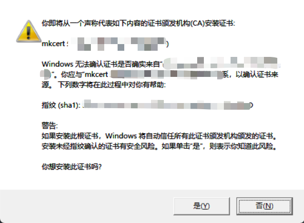

# mkcert

> [mkcert](https://github.com/FiloSottile/mkcert) 是一个用于制作本地信任的开发证书的简单工具。

## windows使用

### 下载安装mkcert

```
choco install mkcer
```

### 安装本地CA到系统中

```
mkcert -install
```



### 生成本地证书

```
mkcert -pkcs12 "localhost" "127.0.0.1"
```
会生成一个名为`localhost.p12`的证书文件，默认的密码是`changeit`
