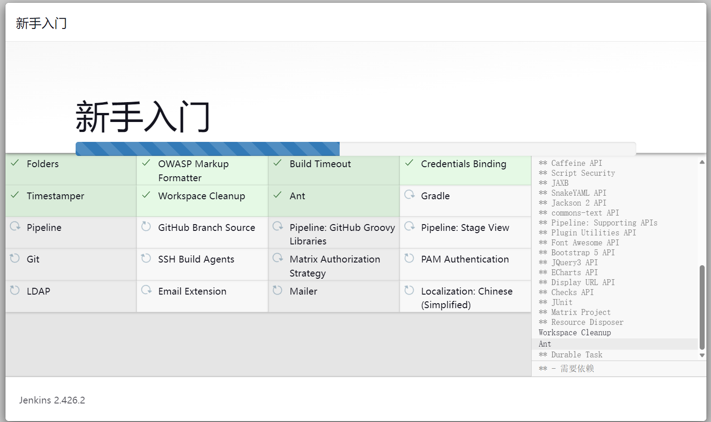
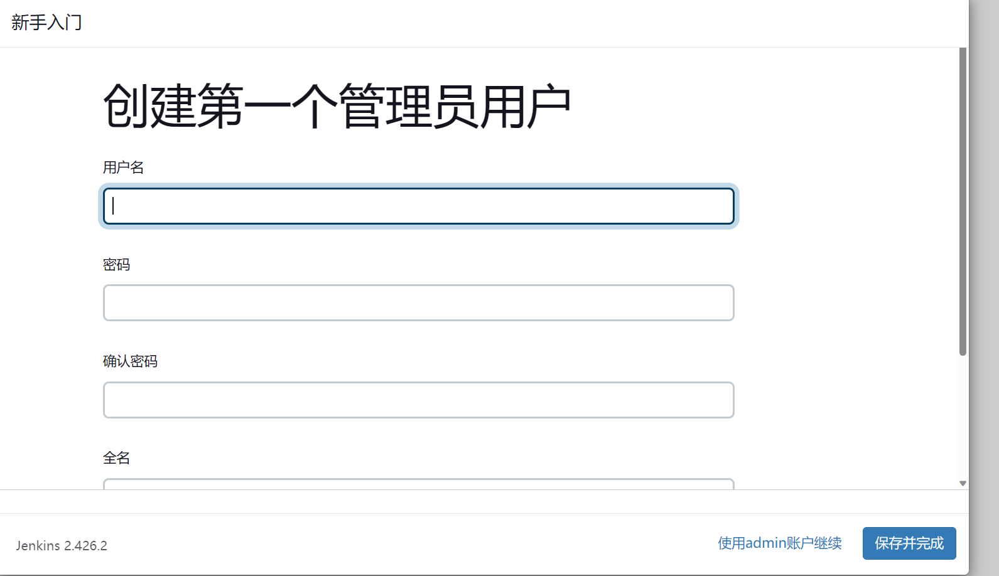
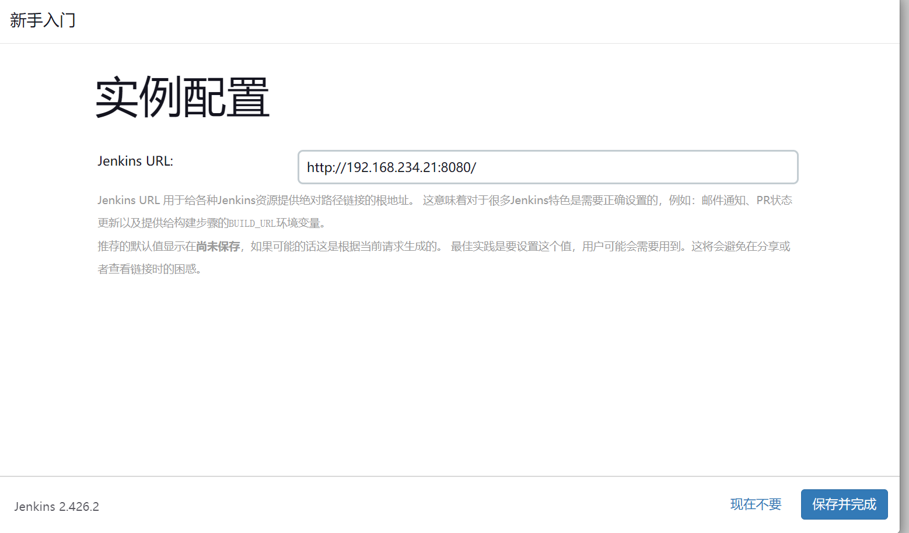
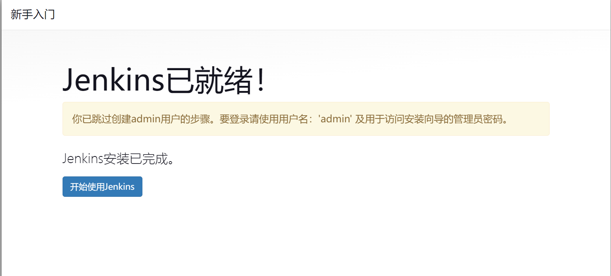
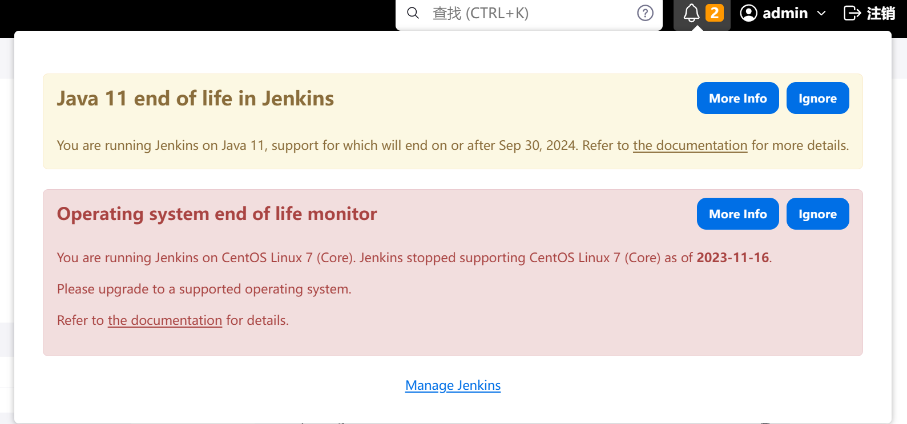
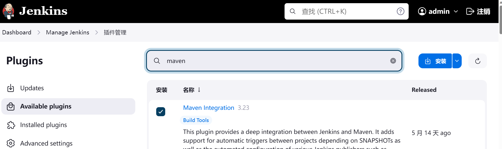
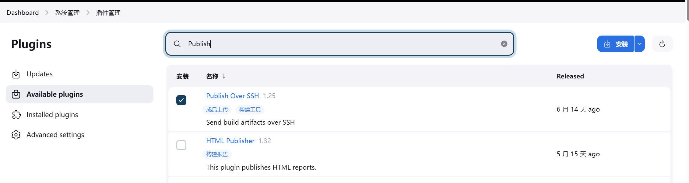

# Jenkins

## 安装

### 前期准备

- 安装了JDK17
- 安装了Maven

### 开通8080端口防火墙

```bash
# 开通8080端口
sudo firewall-cmd --zone=public --add-port=8080/tcp --permanent
# 重新加载防火墙规则
sudo firewall-cmd --reload
```

### 安装git

> 用来拉去代码
```bash
yum install -y git
```

### 下载
```bash
mkdir -p /data/jekins
cd /data/jekins
wget https://archives.jenkins.io/war-stable/latest/jenkins.war
```

### 启动
```
# 默认的是8080端口
java -jar jenkins.war
# 也是指定端口
java -jar jenkins.war --httpPort=8080
```

通过浏览器访问[http://yourip:8080](http://yourip:8080)进入控制台。

在页面上输入启动时显示的下面的一行密码，进入系统。

```bash
Jenkins initial setup is required. An admin user has been created and a password generated.
Please use the following password to proceed to installation:

872dd02b6fa34384bf02b4ccb018c65a
```

在新手入门界面，选择安装推荐的插件。

等待安装


选择创建管理员用户或者使用admin账户继续

> 我这里选择继续使用admin账户继续



实例配置

> 默认，选择保存并完成



开始使用



登录后可以在设置界面改一下`admin`的密码，我这里改为了`123456`，改完确认后需要重新登录。

**看到有警告说在CentOS7上已经停止支持了，早知道换个系统了。**



在`Dashboard>Manage Jenkins`安装`maven`插件



在`Dashboard>Manage Jenkins`安装`Publish Over SSH`插件



安装完`Publish Over SSH`插件可以在`Dashboard>系统管理>System`里新增需要把编译打包的jar包传输到的服务器。


!!! 感觉不是太重要，没配置好，暂时搁置了！

官方文档：

https://www.jenkins.io/zh/doc/