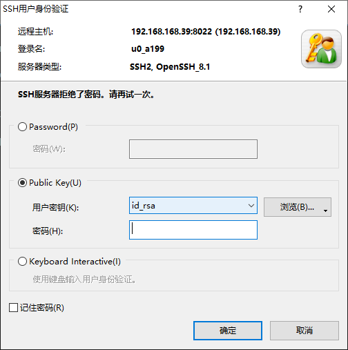
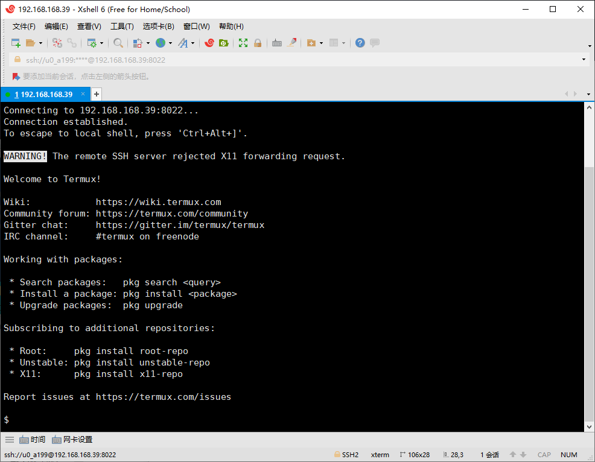
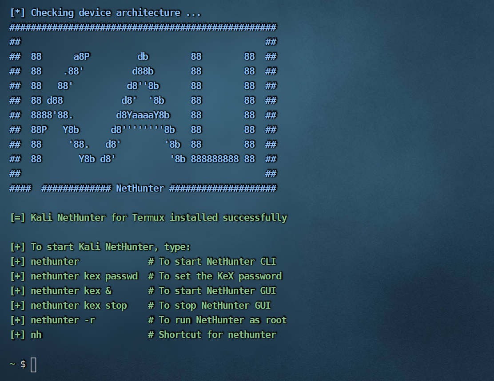

[TOC]

# Termux使用指南

# 基础配置

## 切换镜像

参考 : https://mirrors.tuna.tsinghua.edu.cn/help/termux/

### 图形界面（TUI）替换

在较新版的 Termux 中，官方提供了图形界面（TUI）来半自动替换镜像，推荐使用该种方式以规避其他风险。 在 Termux 中执行如下命令

```shell
termux-change-repo
```

在图形界面引导下，使用自带方向键可上下移动。
第一步使用空格选择需要更换的仓库，之后在第二步选择 TUNA/BFSU 镜像源。确认无误后回车，镜像源会自动完成更换。

### 命令行替换

```shell
sed -i 's@^\(deb.*stable main\)$@#\1\ndeb https://mirrors.tuna.tsinghua.edu.cn/termux/apt/termux-main stable main@' $PREFIX/etc/apt/sources.list
apt update && apt upgrade
```

### 手动修改

编辑 $PREFIX/etc/apt/sources.list 修改为如下内容

```shell
# The termux repository mirror from TUNA:
deb https://mirrors.tuna.tsinghua.edu.cn/termux/apt/termux-main stable main
```

请使用内置或安装在 Termux 里的文本编辑器，例如 `vi` / `vim` / `nano` 等，不要使用 RE 管理器等其他具有 ROOT 权限的外部 APP
来修改 Termux 的文件

## 安装常用软件

```shell
pkg install vim openssh curl wget sl tree nmap netcat-openbsd root-repo openjdk-17 x11-repo termux-exec termux-services proot git python nodejs -y
```

## 设置别名

编辑~/.alias文件

```shell
alias vi='vim'
alias py='python'
alias py2='python2'
alias ll='ls -lh'
alias grep='grep --color=auto'
alias ifconfig='ifconfig 2>/dev/null'
alias ip='ifconfig 2>/dev/null'
alias debian='proot-distro login debian'
alias log='cat ~/shell/service_log.properties'
alias sas='~/.auto_startup/start_service.sh'
alias sos='~/.auto_startup/stop_service.sh'
```

## 设置.bashrc

编辑~/.bashrc文件

```shell
# 获取唤醒锁
termux-wake-lock

# 定义别名
if [ -f ~/.alias ]; then
	. ~/.alias
fi

# 设置语系
LANG=zh_CN.UTF-8
LANGUAGE=zh_CN.UTF-8

# 设置服务的端口
export KODBOX_PORT=9100

# 获取设备名称
device_name=$(getprop ro.product.marketname)
if [ -z "$device_name" ]; then
    device_name=$(getprop net.hostname)
fi

# 打印登录信息
echo "设备: $device_name"
echo "欢迎: "$(whoami)
echo "时间:" `date "+%Y-%m-%d %H:%M"`
echo -e "IP  :\e[33m" `ifconfig|grep 'inet'|cut -d ' ' -f 10|grep -v '127.0.0.1'` "\e[0m"

# 启动所有的服务
sas all

# 检查服务的运行状态
# cs

quikfind(){
# Usage: quikfind
read -p "Enter Filename: " filename
find /sdcard/ | grep ${filename}
}
```

具体脚本情况查[常用运维](#运维脚本)章节

重新加载.bashrc文件

```
source ~/.bashrc
```

## 通过电脑连接手机termux

### 方式1

通过passwd命令设置用户的密码

### 方式2

一、电脑端操作

1、cmd生成公钥、私钥

> ssh-keygen -t rsa

在 `C:\Users\用户名\.ssh\`有生成的公钥 `id_rsa.pub`、私钥 `id_rsa`

2、把id_rsa.pub公钥文件传输到你的手机根目录下。

二、手机端操作

1、在termux上安装openssh，输入 `pkg install openssh`。

2、为了Termux能读出我们手机上的根目录下，需要执行 `termux-setup-storage`命令。现在我们的根目录就被映射到了~/storage/shared。

3、然后我们通过cat命令把根目录的公钥文件内容写到authorized_keys文件里，执行如下命令，
`cat ~/storage/shared/id_rsa.pub >> ~/.ssh/authorized_keys`。

4、上面三部操作完之后现在可以启动手机上ssh服务了，执行 `sshd`命令。

5、接下来查看手机的ip地址，输入 `ifconfig`，可以看到你手机的ip地址形如192.168.1.2，记下来。

6、再查看Termux用户名，输入 `whoami`，能看到形如u0_a82，就是你的用户名，记下来。

三、继续回到电脑上操作：

1、通过xshell或其他ssh工具连接到刚才的ip地址，选择我们刚才生成的私钥。端口默认为8022，密码不用输入。





# 安装其他Linux

## 安装debian

> 使用`proot-distro`安装命令

常用命令

```bash
# 帮助命令
proot-distro help
# 列出所有系统
proot-distro list
# 安装系统
proot-distro install debian
# 启动系统
proot-distro login debian
# 卸载系统
proot-distro remove debian
```

### 使用debian安装ollama

https://www.bilibili.com/read/cv32453978/?jump_opus=1

## 安装nethunter

> Kali NetHunter is a free & Open-source Mobile Penetration Testing Platform for Android devices, based on Kali Linux.
>
> KaliNetHunter是一个基于KaliLinux的Android设备的免费开源移动渗透测试平台.

### 准备安装脚本和系统

- 脚本

```shell
# 下载，因为网路问题，可能下载不成
wget -O install-nethunter-termux https://offs.ec/2MceZWr
# 下载完成后修改权限
chmod 755 install-nethunter-termux
```

- 系统

```shell
wget https://kali.download/nethunter-images/current/rootfs/kalifs-amd64-full.tar.xz
```

**脚本和系统必须放到家目录下**

### 安装系统

```shell
# 运行install-nethunter-termux启动安装
./install-nethunter-termux

# 中间有两次选择，都选n

# 这里要等一会儿才成功
[*] Extracting rootfs..
```



### nethunter访问

- nh #直接命令行进入cli
- nh kex & #后台启动GUI
- nh kex stop #停止GUI

使用vnc工具进入桌面

- 手机
  下载NetHunter KeX,端口设置为5901
- 电脑
  下载VNC Viewer

> 电脑可能无法访问nh的5901端口，通过rinetd工具进行端口转发

```shell
# 安装rinetd
pkg install rinetd
# 配置
vim $PREFIX/etc/rinetd.conf
# 添加下面设置
0.0.0.0    5900    127.0.0.1    5901
#启动rinetd
rinetd
```

### nethunter启停脚本

#### nh_start.sh

```shell
# nh=nethunter
rinetd
nh kex &
```

#### nh_stop.sh

```shell
# nh=nethunter
pkill rinetd
nh kex stop
```

### nethunter界面


# 常用软件

## ngrok

> 内网传透工具

### 下载二进制文件

```bash
wget https://bin.equinox.io/c/bNyj1mQVY4c/ngrok-v3-stable-linux-arm64.tgz
```

> 如果版本有变，需要到[ngrok官网](https://ngrok.com/download)下载。

### 解压

```bash
tar xvzf ngrok-v3-stable-linux-arm64.tgz -C $PREFIX/bin/
```

### 令牌

> [注册](https://dashboard.ngrok.com/signup)一个 Ngrok
> 账户，并获取你的[身份验证令牌](https://dashboard.ngrok.com/get-started/your-authtoken)（auth token）。

```bash
ngrok config add-authtoken xxxxxxxx(your authtoken)
```

### 启动 Ngrok

在`termux-chroot`下启动`ngrok`
，不知道为什么，我有次无法直接使用ngrok.[参考](https://www.reddit.com/r/termux/comments/18wnjoi/using_ngrok_on_termux/?rdt=40538)

> 启动一个 HTTP 隧道，将本地服务（例如在端口 8080 上运行的服务）暴露到外网

```bash
ngrok http 8080
```

## mariadb

### 安装mariadb

更新并升级 Termux 包管理器：

```bash
pkg update && pkg upgrade
```

安装 MariaDB：

```bash
pkg install mariadb
```

初始化 MariaDB 数据目录：

```bash
mariadb-install-db
```

启动mariadb

```bash
mariadbd-safe --datadir=$PREFIX/var/lib/mysql &
```

设置root密码
> 使用系统管理员权限的用户账户（如 u0_a306），可以尝试使用这个用户登录并修改 root 密码：

```bash
mariadb -u `whoami`
```

然后运行：

```bash
ALTER USER 'root'@'localhost' IDENTIFIED BY '123456';
CREATE USER 'root'@'%' IDENTIFIED BY '123456';
GRANT ALL PRIVILEGES ON *.* TO 'root'@'%' WITH GRANT OPTION;
FLUSH PRIVILEGES;
exit;
```

查询系统用户

```mysql
SELECT user, host
FROM mysql.user;
```

完成安全设置

重置 root 密码后，再次运行 mariadb-secure-installation 并使用新密码进行安全设置：

```bash
mariadb-secure-installation
```

停止启动 MariaDB：

```bash
# 停止
killall mariadbd
# 启动
mariadbd-safe --datadir=$PREFIX/var/lib/mysql &
```

### 卸载

```bash
killall mariadbd
pkg uninstall mariadb
rm -rf $PREFIX/var/lib/mysql
rm -rf $PREFIX/etc/my.cnf
```

## redis

### 安装redis

```
pkg install redis
```

### 修改配置

新建数据保存的目录：

```
mkdir -p $PREFIX/var/lib/redis
```

编辑配置文件：

```
vim $PREFIX/etc/redis.conf
```

修改文件里面的内容：

```
# 设置中用户名密码
requirepass redis@123
# 开启AOF持久化
appendonly yes
# 数据保存的位置，刚才新建的地址
dir /data/data/com.termux/files/usr/var/lib/redis
```

### 启动redis

```
redis-server $PREFIX/etc/redis.conf
```

### 停止redis

需要加上密码

```
redis-cli -a redis@123 shutdown
# 或者杀掉进程
pkill redis-server
```

### 卸载redis

```
pkill redis-server
pkg uninstall redis
rm -rf $PREFIX/var/lib/redis
rm -rf $PREFIX/etc/redis.conf
```

## minio

> minio 是AI数据基础设施的对象存储。

### 安装minio

```bash
pkg install minio
```

### 配置自启动

> 确保以及创建了自启动脚本

```bash
ll ~/.auto_startup/startup_manager.sh
```

编辑自启动脚本`~/.auto_startup/startup_manager.sh`, 添加以下内容：

```bash
# minio
if ! pgrep "minio" >/dev/null; then
    echo "starting minio"
    export MINIO_ROOT_USER=minioadmin
    export MINIO_ROOT_PASSWORD=minioadmin
    export MINIO_VOLUMES=$HOME/.minio-data
    export MINIO_OPTS="--console-address :9001"
    nohup minio server $MINIO_OPTS $MINIO_VOLUMES > $SCRIPT_DIR/log/minio.log 2>&1 &
fi
```

### 生效配置

```bash
source ~/.bashrc
```

## nginx

### 简介

> nginx（" engine x "）是一个 HTTP Web 服务器、反向代理、内容缓存、负载均衡器、TCP/UDP 代理服务器和邮件代理服务器。

### 安装nginx

```
pkg install nginx
```

配置文件所在路径：`$PREFIX/etc/nginx/nginx.conf`

### 启动nginx

```
nginx
```

### 停止nginx

```
# 强行停止
nginx -s stop
# 或者使用quit，优雅停止
nginx -s quit
```

## http-server

`http-server` 是一个简单的、零配置的命令行工具，用于快速搭建静态文件服务器。以下是它的使用方法：

确保已经安装了`node.js`

```
pkg install nodejs
```

### 安装

安装`http-server`

```
npm install -g http-server
```

### 启动服务器

在终端中，进入需要托管的静态文件目录，然后运行：

```
http-server
```

默认情况下，服务器会运行在 http://127.0.0.1:8080 或 http://localhost:8080。

### 常用选项

- **指定端口** 使用 `-p` 或 `--port` 指定端口号：

```
http-server -p 3000
```

- **指定目录** 如果希望托管的目录不是当前目录，可以直接指定：

```
http-server path/to/your/directory
```

- **缓存设置** 使用 `-c` 或 `--cache` 设置缓存时间（秒），默认是 3600 秒。如果不希望使用缓存：

```
http-server -c-1
```

- **启用压缩** 使用 `-g` 或 `--gzip` 开启 gzip 压缩，提高传输效率：

```
http-server --gzip
```

- **自动打开浏览器** 使用 `-o` 或 `--open` 自动打开默认浏览器：

```
http-server -o
```

- **HTTPS 支持** 如果需要启用 HTTPS，需要提供密钥和证书：

```
http-server --ssl --cert path/to/cert.pem --key path/to/key.pem
```

### 卸载

如果不需要 http-server，可以通过以下命令卸载：

```
npm uninstall -g http-server
```

## kodbox

>  kodbox（一个轻量级文件管理器）

### 安装kodbox

安装必要的依赖

```
pkg install php curl unzip wget -y
```

从 kodbox 官方网站或 GitHub 下载最新的安装包：

```
mkdir ~/app/
cd ~/app/
wget https://github.com/kalcaddle/kodbox/archive/refs/heads/master.zip -O kodbox.zip
```

解压安装包

```
unzip kodbox.zip
mv kodbox-main kodbox
```

### 启动kodbox

Termux 本身没有完整的 Web 服务器，但我们可以用 PHP 内置的开发服务器运行 kodbox。进入 kodbox 文件夹：

```
cd kodbox
```

运行以下命令启动 PHP 内置服务器：

```
php -S 0.0.0.0:9100
```

在浏览器中访问你的 kodbox 服务器，如：http://localhost:9100 。第一次访问需要进行初始的配置。

## wordpress

> **WordPress** 是一个开源的内容管理系统（Content Management System，简称 CMS），用于创建和管理网站。它最初是一个博客发布平台，但随着功能的不断扩展，如今已经成为全球最流行的网站构建工具之一，可以用来构建各种类型的网站，包括博客、企业网站、电子商务网站、论坛、作品展示网站等。

### 准备

> 更新Termux并安装必要的软件包

```
pkg update && pkg upgrade
pkg install php mariadb nodejs git curl wget
```

确保配置安装了**mariadb**、**php**

### 下载

下载WordPress

```
mkdir ~/app/
cd ~/app/
wget https://wordpress.org/latest.tar.gz
tar -xzvf latest.tar.gz
```

解压完成后存在wordpress目录

### 配置

> 主要是进行数据库的配置

```
cp ~/app/wordpress/wp-config-sample.php ~/app/wordpress/wp-config.php
vim ~/app/wordpress/wp-config.php
```

修改以下内容：

```
define('DB_NAME', 'wordpress');
define('DB_USER', 'root');
define('DB_PASSWORD', '123456');
define('DB_HOST', 'localhost');
```

### 启动

运行以下命令启动 PHP 内置服务器：

```
php -S 0.0.0.0:9200
```

在浏览器中访问你的 wordpress，如：http://localhost:9200 。第一次访问需要进行初始的配置。

## rabbitmq

### 安装rabbitmq

```
pkg install rabbitmq-server
```

### 安装插件

查看插件列表：

```
rabbitmq-plugins list
```

#### rabbitmq_management

web管理端插件：

```
rabbitmq-plugins enable rabbitmq_management --offline
```

#### rabbitmq_delayed_message_exchange

> 该插件可以创建延迟交换机，消息在达到指定延迟时间后才会发送到指定的队列中。

[Rabbit plugins](https://www.rabbitmq.com/community-plugins.html)

[插件GitHub](https://github.com/rabbitmq/rabbitmq-delayed-message-exchange)

下载rabbitmq_delayed_message_exchange

```bash
wget -P $(rabbitmq-plugins directories | grep 'Plugin archives directory' | awk '{print $NF}') https://github.com/rabbitmq/rabbitmq-delayed-message-exchange/releases/download/v4.0.2/rabbitmq_delayed_message_exchange-4.0.2.ez
```

启用插件

```
rabbitmq-plugins enable rabbitmq_delayed_message_exchange --offline && rabbitmq-plugins list
```

### 启动所有稳定特性标志

稳定特性标志子系统是为了允许在不关闭整个集群的情况下 **[滚动升级](https://www.rabbitmq.com/docs/feature-flags)** 集群成员。

列出功能标志:

```
rabbitmqctl list_feature_flags
```

要启用所有稳定特性标志，请使用：

```
rabbitmqctl enable_feature_flag all
```

### 启动服务

```
# 终端前台运行并显示日志
rabbitmq-server
# 后台启动 RabbitMQ 服务，并使其脱离当前终端会话继续运行
rabbitmq-server -detached 
```

启动后访问：http://localhost:15672，用户名密码 `guest/guest`，RabbitMQ 默认的超级用户是 guest，但该用户只能从 localhost
登录。如果你需要远程访问 RabbitMQ，需要创建一个新的用户。

默认开启的端口：

- `15672`： http协议，RabbitMQ 管理插件的 Web UI 和 HTTP API，这是用于 RabbitMQ 管理界面 的端口。如果你启用了
  rabbitmq_management 插件，就会监听这个端口。

- `25672`： Clustering（集群通信），节点间通信与 CLI 工具的管理命令，这是 RabbitMQ 集群节点之间进行同步和数据交换的端口。

- `5672`：AMQP（Advanced Message Queuing Protocol）通信，这是 RabbitMQ 用来接收和发送消息的 主要端口。客户端（如生产者和消费者）通过该端口与
  RabbitMQ 进行通信。

### 创建远程访问的用户

```
# 添加一个新用户（替换 username 和 password 为你自己的用户名和密码）
rabbitmqctl add_user username password

# 给新用户设置管理员权限
rabbitmqctl set_user_tags username administrator

# 设置权限（"/" 是默认 vhost）
rabbitmqctl set_permissions -p / username ".*" ".*" ".*"
```

### 常用命令

- `rabbitmqctl status` 查看服务状态。
- `rabbitmqctl stop` 停止服务。
- `rabbitmqctl list_queues` 查看队列列表。
- `rabbitmqctl list_exchanges` 查看交换机列表。
- `rabbitmqctl list_connections` 查看连接列表。
- `rabbitmqctl list_users` 查看用户列表。

### 升级

在使用`pkg upgrade`进行升级的时候发现，rabbitmq没有把安装的插件和启用的插件开启，需要手动复制（安装）
插件到插件的目录里面。

自己安装的插件可以手动复制到最新的应用目录下。

需要开启的插件建议写在`rabbitmq-plugins directories`指定的
`Enabled plugins file: /data/data/com.termux/files/usr/etc/rabbitmq/enabled_plugins`
文件中，这样就不需要升级的时候再enable插件。或者在安装插件的时候加上`--offline`参数，这是同样在操作开启的插件列表文件。

如下示例：

```
[rabbitmq_management,rabbitmq_delayed_message_exchange].
```

## Lazymux

> [Lazymux]([Gameye98/Lazymux：termux 工具安装程序 --- Gameye98/Lazymux: termux tool installer](https://github.com/Gameye98/Lazymux)) 是一款帮助您在 Android 系统上轻松安装和使用多种渗透测试和黑客工具的工具。它允许用户轻松安装和使用各种流行的工具，例如Nmap、SQLMap和Metasploit。该工具使用起来很简单，因为您只需键入命令即可安装和使用任何工具。 Lazymux 是一个开源项目，对于渗透测试和道德黑客任务来说是一个非常有用的工具。


要求

• Python 3.x 

### 安装Lazymux

```
mkdir -p ~/app/Lazymux
cd ~/app/Lazymux
git clone https://github.com/Gameye98/Lazymux
cd Lazymux
python lazymux.py
```

### 功能

```
 _
( )
| |       _ _  ____  _   _   ___ ___   _   _
| |  _  /'_` )(_  ,)( ) ( )/' _ ` _ `\( ) ( )(`\/')
| |_( )( (_| | /'/_ | (_) || ( ) ( ) || (_) | >  <
(____/'`\__,_)(____)`\__, |(_) (_) (_)`\___/'(_/\_)
                    ( )_| |
                    `\___/'

   [01] Information Gathering
   [02] Vulnerability Analysis
   [03] Web Hacking
   [04] Database Assessment
   [05] Password Attacks
   [06] Wireless Attacks
   [07] Reverse Engineering
   [08] Exploitation Tools
   [09] Sniffing and Spoofing
   [10] Reporting Tools
   [11] Forensic Tools
   [12] Stress Testing
   [13] Install Linux Distro
   [14] Termux Utility
   [15] Shell Function [.bashrc]
   [16] Install CLI Games
   [17] Malware Analysis
   [18] Compiler/Interpreter
   [19] Social Engineering Tools

   [99] Update the Lazymux
   [00] Exit the Lazymux

lzmx > set_install 
```


# 备份与恢复

## 备份

1. 确保有存储权限

```shell
termux-setup-storage
```

2. 备份文件

```shell
tar -zcf /sdcard/termux-backup.tar.gz -C /data/data/com.termux/files ./home ./usr
```

## 恢复

1. 确保有存储权限

```shell
termux-setup-storage
```

2. 恢复备份文件

```shell
tar -zxf /sdcard/termux-backup.tar.gz -C /data/data/com.termux/files --recursive-unlink --preserve-permissions
```

> 恢复后重启应用即可

## 使用系统工具备份与恢复

最新版本的有`termux-backup`和`termux-restore`命令提供备份与恢复操作，可参考官方文档。
参考：https://wiki.termux.com/wiki/Backing_up_Termux

```shell
# 备份
termux-backup /sdcard/backup.tar.xz
# 恢复
termux-restore /sdcard/backup.tar.xz
```

备份在重新安装termux时非常之有用！后悔之前不会备份~

# 常用运维

## 运维脚本

脚本放在.auto_startup目录下，便于同意管理

```bash
mkdir -p ~/.auto_startup
touch ~/.auto_startup/start_service.sh
touch ~/.auto_startup/stop_service.sh
touch ~/.auto_startup/check_service.sh
chmod +x ~/.auto_startup/start_service.sh
chmod +x ~/.auto_startup/stop_service.sh
chmod +x ~/.auto_startup/check_service.sh
```

### 启动服务

`start_service.sh`用来启动各种服务

```bash
#!/bin/bash

SCRIPT_DIR=$(dirname "$(readlink -f "$0")")
LOG_DIR="$SCRIPT_DIR/log"
mkdir -p "$LOG_DIR"
KODBOX_DIR="$HOME/app/kodbox"
KODBOX_PORT="${KODBOX_PORT:-9100}" # 如果未设置，使用默认端口

# 定义服务数组
SERVICES=(
    "sshd"
    "mariadb:mariadbd-safe"
    "redis:redis-server"
    "minio"
    "rabbitmq:rabbitmqctl"
    "nginx"
    "kodbox"
)

# 动态过滤已安装的服务
filter_installed_services() {
    FILTERED_SERVICES=()
    for service in "${SERVICES[@]}"; do
        name="${service%%:*}"
        cmd="${service##*:}"

        if [ "$name" == "kodbox" ]; then
            # 检查 kodbox 的目录是否存在
            if [ -d "$KODBOX_DIR" ]; then
                FILTERED_SERVICES+=("$name")
            fi
        else
            # 检查其他服务的命令是否存在
            if command -v "$cmd" > /dev/null 2>&1; then
                FILTERED_SERVICES+=("$name")
            fi
        fi
    done
    SERVICES=("${FILTERED_SERVICES[@]}")
}

# 调用过滤函数
filter_installed_services

# 启动服务的函数
start_service() {
    case "$1" in
        "sshd")
            if ! pgrep -x "sshd" >/dev/null; then
                echo "Starting sshd"
                sshd
            fi
            ;;
        "mariadb")
            if ! pgrep "mariadb" >/dev/null; then
                echo "Starting mariadb"
                nohup mariadbd-safe --datadir=$PREFIX/var/lib/mysql > "$LOG_DIR/mariadb.log" 2>&1 &
            fi
            ;;
        "redis")
            if ! pgrep "redis" >/dev/null; then
                echo "Starting redis"
                nohup redis-server $PREFIX/etc/redis.conf > "$LOG_DIR/redis.log" 2>&1 &
            fi
            ;;
        "minio")
            if ! pgrep "minio" >/dev/null; then
                echo "Starting minio"
                export MINIO_ROOT_USER=minioadmin
                export MINIO_ROOT_PASSWORD=minioadmin
                export MINIO_VOLUMES=$HOME/.minio-data
                export MINIO_OPTS="--console-address :9001"
                nohup minio server $MINIO_OPTS $MINIO_VOLUMES > "$LOG_DIR/minio.log" 2>&1 &
            fi
            ;;
        "rabbitmq")
            if ! pgrep "beam" >/dev/null; then
                echo "Starting rabbitmq"
                rabbitmq-server -detached
            fi
            ;;
        "nginx")
            if ! pgrep "nginx" >/dev/null; then
                echo "Starting nginx"
                nginx
            fi
            ;;
        "kodbox")
            if ! pgrep -f "php -S 0.0.0.0:$KODBOX_PORT" >/dev/null; then
                echo "Starting kodbox"
                nohup php -S 0.0.0.0:$KODBOX_PORT -t "$KODBOX_DIR" > "$LOG_DIR/kodbox.log" 2>&1 &
            fi
            ;;
        *)
            echo "Unknown service: $1"
            ;;
    esac
}

# 显示服务菜单
show_menu() {
    echo "Available services to start:" 
    for i in "${!SERVICES[@]}"; do
        echo "$((i + 1)). ${SERVICES[$i]}"
    done
    echo "Enter the number of the service to start, or 0 to start all:"
    read -r choice

    if [[ "$choice" =~ ^[0-9]+$ ]] && [ "$choice" -ge 0 ] && [ "$choice" -le "${#SERVICES[@]}" ]; then
        if [ "$choice" -eq 0 ]; then
            for SERVICE in "${SERVICES[@]}"; do
                start_service "$SERVICE"
            done
        else
            start_service "${SERVICES[$((choice - 1))]}"
        fi
    else
        echo "Invalid choice. Exiting."
    fi
}

if [ "$#" -eq 0 ]; then
    show_menu
elif [ "$1" == "all" ]; then
    for SERVICE in "${SERVICES[@]}"; do
        start_service "$SERVICE"
    done
else
    for SERVICE in "$@"; do
        start_service "$SERVICE"
    done
fi
```

使用方法：

```bash
# 进入可选服务选项
./start_service.sh
# 启动指定服务
./start_service.sh redis minio
# 启动所有服务
./start_service.sh all
```

如果为脚本配置了别名，可以直接使用别名启动服务，如在~/.alias中添加了[别名](#别名)：

```bash
# 进入可选服务选项
sas
# 启动指定服务
sas redis minio
# 启动所有服务
sas all
```

### 停止服务

`stop_service.sh`用来停止各种服务

```bash
#!/bin/bash

# 定义服务数组
SERVICES=(
    "mariadb:mariadbd-safe"
    "redis:redis-server"
    "minio"
    "rabbitmq:rabbitmqctl"
    "kodbox"
    "nginx"
)

# 动态过滤已安装的服务
filter_installed_services() {
    # 使用一个新数组来存储过滤后的服务名称
    SERVICES=($(for service in "${SERVICES[@]}"; do
        # 获取服务名称和命令
        name="${service%%:*}"
        cmd="${service##*:}"
        # 如果没有提供命令，使用服务名作为命令
        if [ -z "$cmd" ]; then
            cmd="$name"
        fi
        
        if [ "$cmd" == "kodbox" ]; then
            # 检查 kodbox 的目录是否存在
            if [ -d "$HOME/app/kodbox" ]; then
               echo "$name"
            fi
        else
            # 检查命令是否安装
            command -v "$cmd" > /dev/null 2>&1 && echo "$name"
        fi
        
    done))
}

# 调用过滤函数
filter_installed_services

# 停止服务的函数
stop_service() {
    case "$1" in
        "mariadb")
            if pgrep "mariadb" > /dev/null; then
                echo "Stopping mariadb"
                pkill mariadbd
                sleep 1
                if ! pgrep "mariadb" > /dev/null; then
                    echo "mariadb is closed"
                fi
            else
                echo "mariadb is not running"
            fi
            ;;
        "redis")
            if pgrep "redis" > /dev/null; then
                echo "Stopping redis"
                pkill redis-server
                sleep 1
                if ! pgrep "redis" > /dev/null; then
                    echo "redis is closed"
                fi
            else
                echo "redis is not running"
            fi
            ;;
        "minio")
            if pgrep "minio" > /dev/null; then
                echo "Stopping minio"
                pkill minio
                sleep 1
                if ! pgrep "minio" > /dev/null; then
                    echo "minio is closed"
                fi
            else
                echo "minio is not running"
            fi
            ;;
        "rabbitmq")
            if pgrep "beam" > /dev/null; then
                echo "Stopping rabbitmq"
                rabbitmqctl stop
                sleep 3
                if ! pgrep "beam" > /dev/null; then
                    echo "rabbitmq is closed"
                fi
            else
                echo "rabbitmq is not running"
            fi
            ;;
        "nginx")
            if pgrep "nginx" > /dev/null; then
                echo "Stopping nginx"
                nginx -s stop
                sleep 1
                if ! pgrep "nginx" > /dev/null; then
                    echo "nginx is closed"
                fi
            else
                echo "nginx is not running"
            fi
            ;;
        "kodbox")
            if pgrep -f "php -S.*${KODBOX_PORT:-9100}.*kodbox" >/dev/null; then
                echo "Stopping kodbox"
                kill -9 $(pgrep -f "php -S.*${KODBOX_PORT:-9100}.*kodbox")
                sleep 1
                if ! pgrep -f "php -S.*${KODBOX_PORT:-9100}.*kodbox" > /dev/null; then
                    echo "kodbox is closed"
                fi
            else
                echo "kodbox is not running"
            fi
            ;;
        *)
            echo "Unknown service: $1"
            ;;
    esac
}

# 显示服务菜单
show_menu() {
    if [ ${#SERVICES[@]} -eq 0 ]; then
        echo "No installed services found. Exiting."
        exit 0
    fi

    echo "Available services to stop:"
    for i in "${!SERVICES[@]}"; do
        echo "$((i + 1)). ${SERVICES[$i]}"
    done
    echo "Enter the number of the service to stop, or 0 to stop all:"
    read -r choice

    if [[ "$choice" =~ ^[0-9]+$ ]] && [ "$choice" -ge 0 ] && [ "$choice" -le "${#SERVICES[@]}" ]; then
        if [ "$choice" -eq 0 ]; then
            # 停止所有服务
            for service in "${SERVICES[@]}"; do
                stop_service "$service"
            done
        else
            # 停止指定序号的服务
            stop_service "${SERVICES[$((choice - 1))]}"
        fi
    else
        echo "Invalid choice. Exiting."
    fi
}

# 检查是否传入参数
if [ "$#" -eq 0 ]; then
    # 没有参数时，显示菜单
    show_menu
elif [ "$1" == "all" ]; then
    # 参数为 "all" 时，停止所有服务
    for service in "${SERVICES[@]}"; do
        stop_service "$service"
    done
else
    # 有参数时，只停止指定的服务
    for arg in "$@"; do
        if [[ " ${SERVICES[*]} " == *" $arg "* ]]; then
            stop_service "$arg"
        else
            echo "Service $arg not found in the defined list or not installed."
        fi
    done
fi
```

如果为脚本配置了别名，可以直接使用别名启动服务，如在~/.alias中添加了[别名](#别名)：

```bash
# 进入可选服务选项
sos
# 停止指定服务
sos redis minio
# 停止所有服务
sos all
```

### 检查服务状态

`check_service.sh`用来检查各种服务的状态

```bash
#!/bin/bash

# 定义服务及其相关端口的数组
# 格式：服务名:端口1,端口2,...
SERVICES_PORTS=(
    "mariadb:3306"
    "minio:9000,9001"
    "rabbitmq:5672,15672,25672"
    "redis:6379"
    "sshd:8022"
    "kodbox:${KODBOX_PORT:-9100}"
)

# 从 nginx.conf 提取端口，过滤掉注释行
extract_nginx_ports() {
    local nginx_conf=$PREFIX/etc/nginx/nginx.conf  # 修改为你的 nginx.conf 路径
    local ports=()
    if [ -f "$nginx_conf" ]; then
        ports=$(nginx -T 2>/dev/null | grep -Eo '^\s*listen[[:space:]]+[0-9]+'| awk '{print $2}' | sort -u | tr '\n' ',')
        ports="${ports%,}"  # 移除末尾多余的逗号
    fi
    echo "$ports"
}

# 添加 Nginx 的端口到服务列表
nginx_ports=$(extract_nginx_ports)
if [ -n "$nginx_ports" ]; then
    SERVICES_PORTS+=("nginx:$nginx_ports")
fi

# 定义颜色
GREEN="\033[0;32m"
RED="\033[0;31m"
BOLD="\033[1m"
RESET="\033[0m"

# 计算对齐宽度
ALIGN_WIDTH=$(printf "%s\n" "${SERVICES_PORTS[@]}" | cut -d: -f1 | awk '{ if (length > max) max = length } END { print max }')

# 检查服务是否已安装
is_service_installed() {
    case "$1" in
        "mariadb")
            command -v mariadbd >/dev/null 2>&1
            ;;
        "minio")
            command -v minio >/dev/null 2>&1
            ;;
        "rabbitmq")
            command -v rabbitmq-server >/dev/null 2>&1
            ;;
        "redis")
            command -v redis-server >/dev/null 2>&1
            ;;
        "sshd")
            command -v sshd >/dev/null 2>&1
            ;;
        "nginx")
            command -v nginx >/dev/null 2>&1
            ;;
        "kodbox")
            # 检查 kodbox 目录是否存在
            [ -d "$HOME/app/kodbox" ]
            ;;
        *)
            return 1
            ;;
    esac
}

# 检查服务端口状态的函数
check_service() {
    local service="$1"
    local ports="$2"

    # 跳过未安装的服务
    if ! is_service_installed "$service"; then
        return
    fi

    local is_running=0
    local open_ports=()
    local closed_ports=()

    # 遍历所有端口
    for port in $(echo "$ports" | tr "," " "); do
        nc -z localhost "$port" > /dev/null 2>&1
        if [ $? -eq 0 ]; then
            open_ports+=("$port")
            is_running=1
        else
            closed_ports+=("$port")
        fi
    done

    # 输出服务信息
    if [ $is_running -eq 1 ]; then
        # 打印开放的端口和关闭的端口（绿色和红色区分）
        printf "%b%-${ALIGN_WIDTH}s%b is %brunning%b at %b%s%b %s\n" \
            "$BOLD" "$service" "$RESET" "$GREEN" "$RESET" \
            "$GREEN" "$(IFS=","; echo "${open_ports[*]}")" "$RESET" \
            "$(IFS=","; echo "${closed_ports[*]}")"
    else
        # 服务关闭，打印所有端口（红色）
        printf "%b%-${ALIGN_WIDTH}s%b is %bclosed%b. (%b%s%b)\n" \
            "$BOLD" "$service" "$RESET" "$RED" "$RESET" \
            "$RED" "$(IFS=","; echo "${ports[*]}")" "$RESET"
    fi
}

# 检查所有服务
default_check_all() {
    for entry in "${SERVICES_PORTS[@]}"; do
        service=$(echo "$entry" | cut -d: -f1)
        ports=$(echo "$entry" | cut -d: -f2)
        check_service "$service" "$ports"
    done
}

# 检查是否传入参数
if [ "$#" -eq 0 ]; then
    # 没有参数时，检查所有服务
    default_check_all
else
    # 有参数时，只检查指定的服务
    for arg in "$@"; do
        found=0
        for entry in "${SERVICES_PORTS[@]}"; do
            service=$(echo "$entry" | cut -d: -f1)
            ports=$(echo "$entry" | cut -d: -f2)
            if [ "$arg" == "$service" ]; then
                check_service "$service" "$ports"
                found=1
                break
            fi
        done
        if [ $found -eq 0 ]; then
            echo "Service $arg not found in the defined list."
        fi
    done
fi
```

使用方法：

```bash
# 显示所有服务状态
./check_service.sh
# 显示指定服务状态
./check_service.sh redis minio
```

如果为脚本配置了别名，可以直接使用别名启动服务，如在~/.alias中添加了[别名](#别名)：

```bash
# 显示所有服务状态
cs
# 显示指定服务状态
cs redis minio
```

## 开启传统Linux文件布局

> 前提：已安装`proot`

运行示例：

```bash
termux-chroot
ls /
```

## 查询开放的端口

安装了`netcat`后，可以使用`nc`命令来查询开放的端口：

```bash
# 查看指定的端口
nc -zv 127.0.0.1 8080
# 查看所有指定范围的端口
nc -zv 127.0.0.1 1-8080
```

常用参数：

- `-z`：只测试端口是否打开，不进行数据传输
- `-v`：显示详细信息

## 查看进程占用端口

```
ps -auxf
```

## 杀掉一个进程

```
pkill -9 <PID>
```

# 终端设置

详细设置参考：https://wiki.termux.com/wiki/Terminal_Settings

Termux 终端可以通过编辑 `~/.termux/termux.properties` 文件来配置。该文件使用简单的 `key=value` 属性语法。

要使更改在编辑属性文件后生效，请执行 `termux-reload-settings` 或通过关闭所有会话并再次启动应用程序来重新启动 Termux。

## 深色主题

> 强制应用程序对抽屉和对话框使用深色主题

```properties
use-black-ui=true
```

*注意：如果系统 UI 使用深色主题，则会在 Android 9+ 上自动启用此功能。*

## 全屏模式

> 启用全屏模式

```properties
fullscreen=true
```

启用全屏后，“额外按键”视图可能不再可见。要修复，请添加

```properties
use-fullscreen-workaround=true
```

*注意：全屏可能不适用于所有设备，因此目前认为它不稳定。*

## 键盘输入问题

> 手机在使用英文输入时，需要进行单词候选才能把命令输入到终端中，这与平时的终端使用不太一致，可以修改如下配置

```properties
enforce-char-based-input=true
```