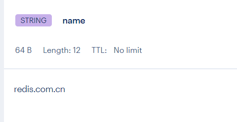
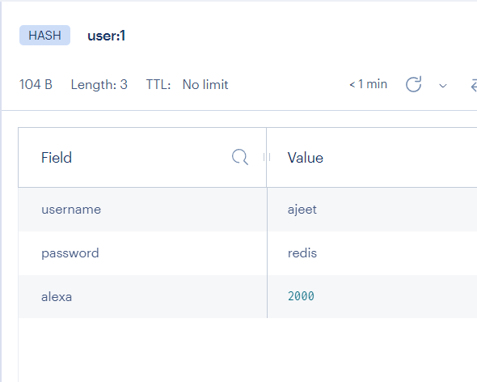
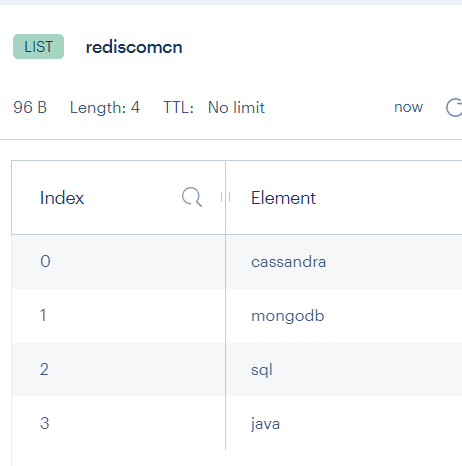
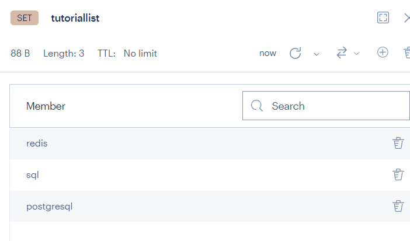

参考：[Redis中文教程](https://redis.com.cn/tutorial.html)

# Redis数据类型

Redis 数据库支持多种数据类型。
- 字符串（string）
- 哈希（hash）
- 列表（list）
- 集合（set）
- 有序集合（sorted set）
- 位图 ( Bitmaps )
- 基数统计 ( HyperLogLogs )

## 字符串（string）
String 是一组字节。在 Redis 数据库中，字符串是二进制安全的。这意味着它们具有已知长度，并且不受任何特殊终止字符的影响。可以在一个字符串中存储最多 512 兆字节的内容。

例

使用 SET 命令在 name 键中存储字符串 `redis.com.cn`，然后使用 GET 命令查询 name。

```redis
SET name "redis.com.cn"  
OK  
GET name   
"redis.com.cn"
```

在上面的例子中，SET 和 GET 是 Redis 命令，name 是 Redis 中使用的 key，`redis.com.cn` 是存储在 Redis 中的字符串值。

[使用场景](https://zhuanlan.zhihu.com/p/631670359)：

- 缓存对象
- 常规计数
- 分布式锁
- 共享 Session 信息



## 哈希（hash）

哈希是键值对的集合。在 Redis 中，哈希是字符串字段和字符串值之间的映射。因此，它们适合表示对象。

例

让我们存储一个用户的对象，其中包含用户的基本信息。

```redis
HMSET user:1 username ajeet password redis alexa 2000  
OK  
HGETALL  user:1  
"username"  
"ajeet"  
"password"  
"redis"  
"alexa"  
"2000"

```

这里，HMSET 和 HGETALL 是 Redis 的命令，而 user：1 是键。

每个哈希可以存储多达 2³² - 1 个键-值对。

[使用场景](https://zhuanlan.zhihu.com/p/631670359)：

- 缓存对象
- 购物车

## 列表（list）

Redis 列表定义为字符串列表，按插入顺序排序。可以将元素添加到 Redis 列表的头部或尾部。

例

```redis
lpush rediscomcn java  
(integer) 1  
lpush rediscomcn sql
(integer) 1  
lpush rediscomcn mongodb
(integer) 1  
lpush rediscomcn cassandra
(integer) 1  
lrange rediscomcn 0 10  
"cassandra"  
"mongodb"  
"sql"  
"java"
```
列表的最大长度为 2³² – 1 个元素（超过 40 亿个元素）。



[使用场景](https://zhuanlan.zhihu.com/p/631670359)：

- 消息队列
- 

## 集合（set）

集合（set）是 Redis 数据库中的无序字符串集合。在 Redis 中，添加，删除和查找的时间复杂度是 O(1)。

例
```redis
sadd tutoriallist redis  
(integer) 1  
redis 127.0.0.1:6379> sadd tutoriallist sql  
(integer) 1  
redis 127.0.0.1:6379> sadd tutoriallist postgresql  
(integer) 1  
redis 127.0.0.1:6379> sadd tutoriallist postgresql  
(integer) 0  
redis 127.0.0.1:6379> sadd tutoriallist postgresql  
(integer) 0  
redis 127.0.0.1:6379> smembers tutoriallist
1) "redis"
2) "postgresql"
3) "sql"
```



在上面的示例中，您可以看到 postgresql 被添加了三次，但由于该集的唯一属性，它只添加一次。

集合中的最大成员数为 2³² -1 个元素（超过 40 亿个元素）。

[使用场景](https://zhuanlan.zhihu.com/p/631670359)：

- 点赞
- 共同关注
- 抽奖活动

## 有序集合（sorted set）

Redis 有序集合类似于 Redis 集合，也是一组非重复的字符串集合。但是，排序集的每个成员都与一个分数相关联，该分数用于获取从最小到最高分数的有序排序集。虽然成员是独特的，但可以重复分数。

例

```redis
redis 127.0.0.1:6379> zadd tutoriallist-z 0 redis  
(integer) 1  
redis 127.0.0.1:6379> zadd tutoriallist-z 0 sql  
(integer) 1  
redis 127.0.0.1:6379> zadd tutoriallist-z 0 postgresql  
(integer) 1  
redis 127.0.0.1:6379> zadd tutoriallist-z 0 postgresql  
(integer) 0  
redis 127.0.0.1:6379> zadd tutoriallist-z 0 postgresql  
(integer) 0  
redis 127.0.0.1:6379> ZRANGEBYSCORE tutoriallist-z 0 10
1) "postgresql"
2) "redis"
3) "sql"
```


[使用场景](https://zhuanlan.zhihu.com/p/631670359)：

- 排行榜
- 电话、姓名排序

## 位图 ( Bitmaps )

Redis Bitmap 通过类似 map 结构存放 0 或 1 ( bit 位 ) 作为值。

Redis Bitmap 可以用来统计状态，如`日活`是否浏览过某个东西。

Redis setbit 命令

> Redis setbit 命令用于设置或者清除一个 bit 位。

Redis setbit 命令语法格式

> **SETBIT key offset value**

范例

```redis
127.0.0.1:6379> setbit aaa:001 10001 1 # 返回操作之前的数值
(integer) 0
127.0.0.1:6379> setbit aaa:001 10002 2 # 如果值不是0或1就报错
(error) ERR bit is not an integer or out of range
127.0.0.1:6379> setbit aaa:001 10002 0
(integer) 0
127.0.0.1:6379> setbit aaa:001 10003 1
(integer) 0
```

[使用场景](https://zhuanlan.zhihu.com/p/631670359)：

- 签到统计
- 判断用户登陆态
- 连续签到用户总数

## 基数统计 ( HyperLogLogs )

没有到，参考官网[基数统计](https://redis.com.cn/redis-data-types.html#%E5%9F%BA%E6%95%B0%E7%BB%9F%E8%AE%A1)
