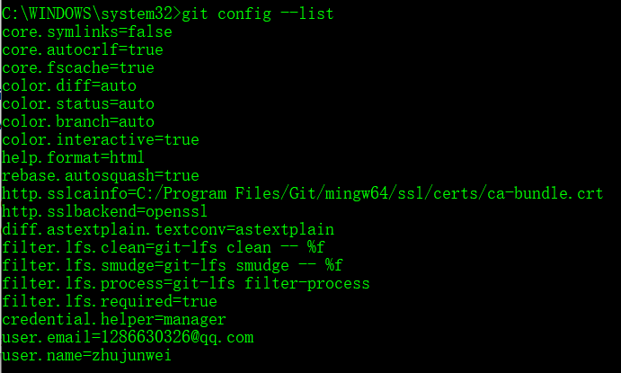
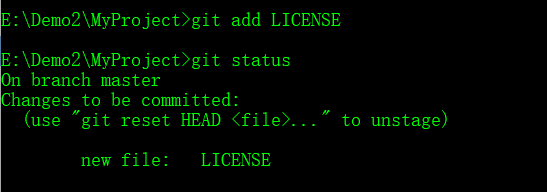
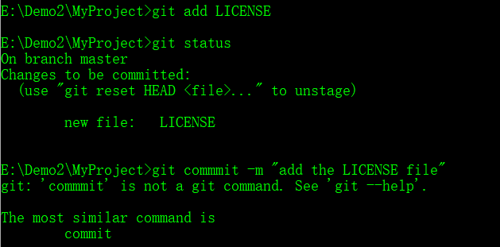
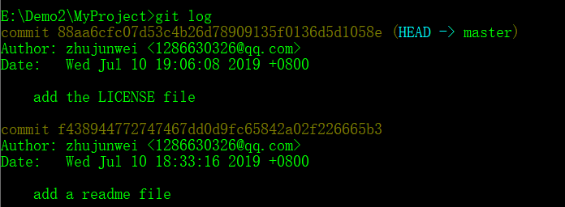
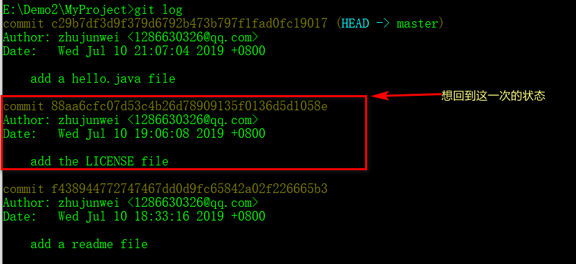

git安装

# 1 git基础知识

## 1.1 git初次使用配置

在命令行模式里输入以下命令：

>git config --global user.name "用户名"
>
>git config --global user.email "邮箱"

查看配置信息

> git config --list

git记录的是什么？

> git将每个版本独立保存

git的工作流程

> 1.在工作目录中添加、修改文件
>
> 2.将需要进行版本管理的文件放入暂存区域
>
> 3.将暂存区域的文件提交到Git仓库

git管理的文件有三种状态

> 已修改（modified）
>
> 已暂存（staged）
>
> 已提交(committed)

## 1.2 git的简单使用

创建一个空的文件夹作为存放项目的位置

在命令行模式下进入该文件夹，输入以下指令

> e:
>
> cd E:\Demo2\MyProject
>
> git init

此时在该文件夹下出现了一个隐藏的.git文件夹

在我们创建的文件夹下创建一个readme.md文件

输入以下指令提交

>git add readme.md
>
>git commit -m "add a readme file"

## 1.3 新增加文件

没有任何变化查看项目状态

> git status

当我们新建了一个LICENSE文件后查看状态

我们在添加LICENSE到缓存区后查看状态

> git add LICENSE
>
> git status

我们可以使用你reset命令将缓存区的文件从缓存区清除

> get reset HEAD LICENSE
>
> git status

如果缓存区有我们未提交的文件，这时又修改了文件，查看状态

我们可以将LICENSE文件重新添加到缓冲区并提交

> git add LICENSE
>
> git commit -m "add the LICENSE file"

##  1.4 查看历史提交记录

> git log

## 1.5 回到过去

先查看一下提交的历史，发现有三次，如果想回到上一次记录应该怎么办呢？

### 查看记录

> git log

### 版本回退

> //回退到上一版本
>
> git reset HEAD~
>
> //回退到上上版本
>
> git reset HEAD~~
>
> 或
>
> git reset HEAD~2 

文件变为了未提交的状态