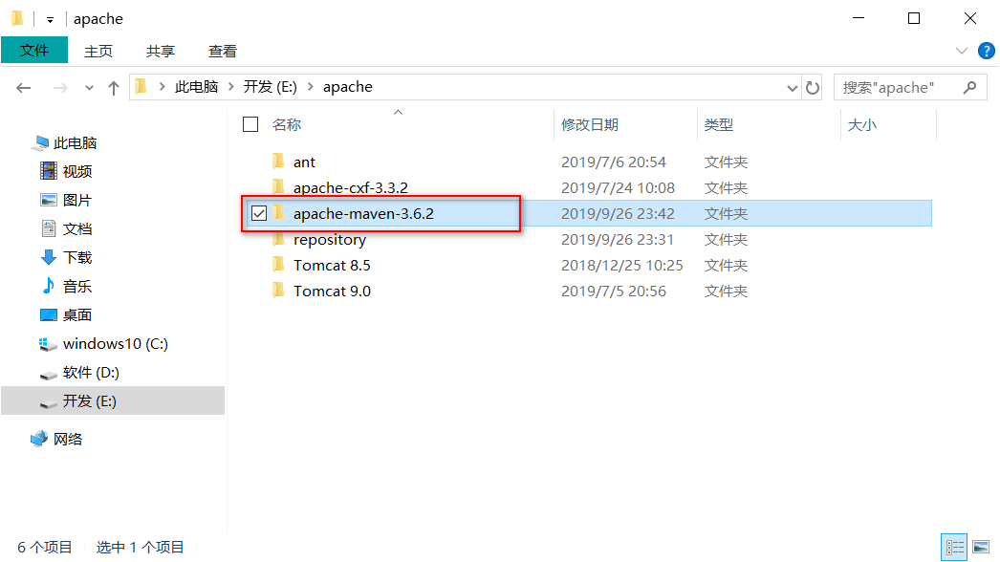
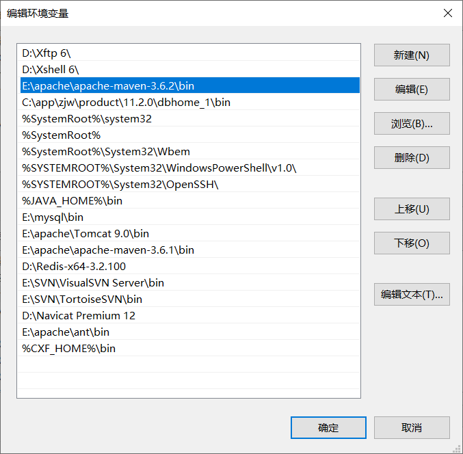
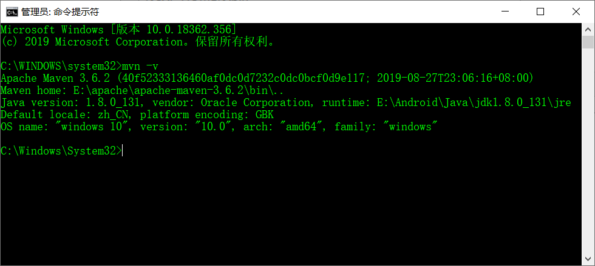
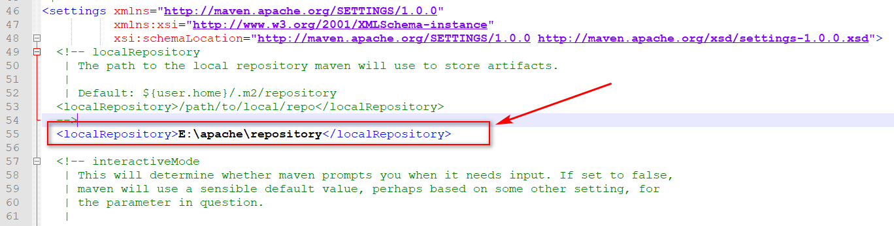
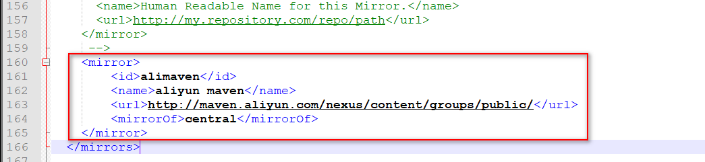
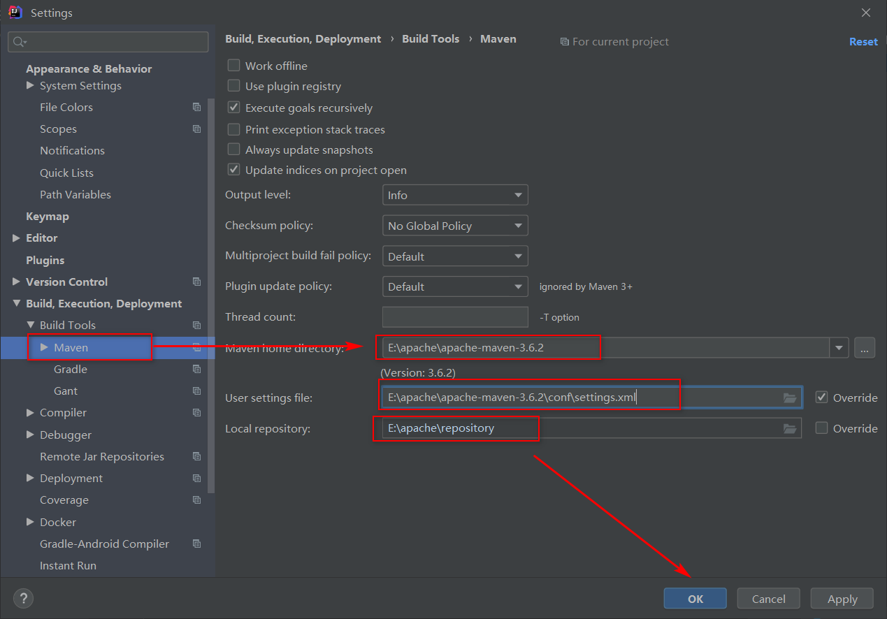
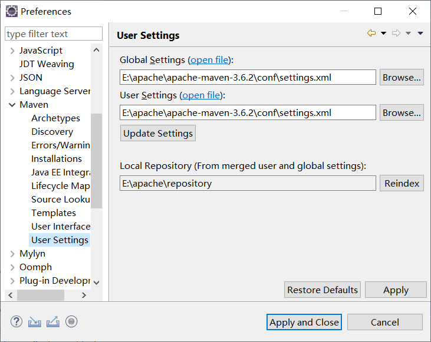

# Maven

> 安装前确保已经安装了JDK（最好8+）

## windows

### 1、下载

[maven官方][]

[清华镜像下载maven][]

### 2、解压



### 3、配置maven所在路径



在命令行使用命令`mvn -v`查看maven路径是否配置正确




### 4、配置本地仓库位置、镜像位置

打开..\apache-maven-3.6.2\conf\setting.xml

#### 4.1 仓库位置(本地仓库)

设置本地仓库的位置



#### 4.2 镜像位置(远程仓库)

这里配置阿里云的仓库



```xml
<mirror>
    <id>alimaven</id>
    <name>aliyun maven</name>
    <url>http://maven.aliyun.com/nexus/content/groups/public/</url>
    <mirrorOf>central</mirrorOf>       
</mirror>
```

### 5、IDEA配置maven



### 6、Eclipse配置maven



## CentOS7

### 下载解压

[maven官方][]

```bash
# 清华源下载
wget https://mirrors.tuna.tsinghua.edu.cn/apache/maven/maven-3/3.9.6/binaries/apache-maven-3.9.6-bin.tar.gz
```

解压

```shell
tar -xzvf apache-maven-3.9.6-bin.tar.gz -C /opt/
ll /opt/
```

配置环境变量

> 编辑`~/.bashrc`配置文件。在最末尾加上如下内容。

```shell
export MAVEN_HOME=/opt/apache-maven-3.9.6
export PATH=$MAVEN_HOME/bin:$PATH
```

生效配置
```bash
source ~/.bashrc
```

配置本地仓库位置

> 编辑`$MAVEN_HOME/conf/settings.xml`

```xml
<?xml version="1.0" encoding="UTF-8"?>

<!--
Licensed to the Apache Software Foundation (ASF) under one
or more contributor license agreements.  See the NOTICE file
distributed with this work for additional information
regarding copyright ownership.  The ASF licenses this file
to you under the Apache License, Version 2.0 (the
"License"); you may not use this file except in compliance
with the License.  You may obtain a copy of the License at

    http://www.apache.org/licenses/LICENSE-2.0

Unless required by applicable law or agreed to in writing,
software distributed under the License is distributed on an
"AS IS" BASIS, WITHOUT WARRANTIES OR CONDITIONS OF ANY
KIND, either express or implied.  See the License for the
specific language governing permissions and limitations
under the License.
-->

<!--
 | This is the configuration file for Maven. It can be specified at two levels:
 |
 |  1. User Level. This settings.xml file provides configuration for a single user,
 |                 and is normally provided in ${user.home}/.m2/settings.xml.
 |
 |                 NOTE: This location can be overridden with the CLI option:
 |
 |                 -s /path/to/user/settings.xml
 |
 |  2. Global Level. This settings.xml file provides configuration for all Maven
 |                 users on a machine (assuming they're all using the same Maven
 |                 installation). It's normally provided in
 |                 ${maven.conf}/settings.xml.
 |
 |                 NOTE: This location can be overridden with the CLI option:
 |
 |                 -gs /path/to/global/settings.xml
 |
 | The sections in this sample file are intended to give you a running start at
 | getting the most out of your Maven installation. Where appropriate, the default
 | values (values used when the setting is not specified) are provided.
 |
 |-->
<settings xmlns="http://maven.apache.org/SETTINGS/1.0.0"
          xmlns:xsi="http://www.w3.org/2001/XMLSchema-instance"
          xsi:schemaLocation="http://maven.apache.org/SETTINGS/1.0.0 http://maven.apache.org/xsd/settings-1.0.0.xsd">
          
  <!--本地仓库位置-->
  <localRepository>/data/repository</localRepository>

  <!-- interactiveMode
   | This will determine whether maven prompts you when it needs input. If set to false,
   | maven will use a sensible default value, perhaps based on some other setting, for
   | the parameter in question.
   |
   | Default: true
  <interactiveMode>true</interactiveMode>
  -->

  <!-- offline
   | Determines whether maven should attempt to connect to the network when executing a build.
   | This will have an effect on artifact downloads, artifact deployment, and others.
   |
   | Default: false
  <offline>false</offline>
  -->

  <!-- pluginGroups
   | This is a list of additional group identifiers that will be searched when resolving plugins by their prefix, i.e.
   | when invoking a command line like "mvn prefix:goal". Maven will automatically add the group identifiers
   | "org.apache.maven.plugins" and "org.codehaus.mojo" if these are not already contained in the list.
   |-->
  <pluginGroups>
    <!-- pluginGroup
     | Specifies a further group identifier to use for plugin lookup.
    <pluginGroup>com.your.plugins</pluginGroup>
    -->
  </pluginGroups>

  <!-- proxies
   | This is a list of proxies which can be used on this machine to connect to the network.
   | Unless otherwise specified (by system property or command-line switch), the first proxy
   | specification in this list marked as active will be used.
   |-->
  <proxies>
    <!-- proxy
     | Specification for one proxy, to be used in connecting to the network.
     |
    <proxy>
      <id>optional</id>
      <active>true</active>
      <protocol>http</protocol>
      <username>proxyuser</username>
      <password>proxypass</password>
      <host>proxy.host.net</host>
      <port>80</port>
      <nonProxyHosts>local.net|some.host.com</nonProxyHosts>
    </proxy>
    -->
  </proxies>

  <!-- servers
   | This is a list of authentication profiles, keyed by the server-id used within the system.
   | Authentication profiles can be used whenever maven must make a connection to a remote server.
   |-->
  <servers>
    <!-- server
     | Specifies the authentication information to use when connecting to a particular server, identified by
     | a unique name within the system (referred to by the 'id' attribute below).
     |
     | NOTE: You should either specify username/password OR privateKey/passphrase, since these pairings are
     |       used together.
     |
    <server>
      <id>deploymentRepo</id>
      <username>repouser</username>
      <password>repopwd</password>
    </server>
    -->

    <!-- Another sample, using keys to authenticate.
    <server>
      <id>siteServer</id>
      <privateKey>/path/to/private/key</privateKey>
      <passphrase>optional; leave empty if not used.</passphrase>
    </server>
    -->
  </servers>

  <!-- mirrors
   | This is a list of mirrors to be used in downloading artifacts from remote repositories.
   |
   | It works like this: a POM may declare a repository to use in resolving certain artifacts.
   | However, this repository may have problems with heavy traffic at times, so people have mirrored
   | it to several places.
   |
   | That repository definition will have a unique id, so we can create a mirror reference for that
   | repository, to be used as an alternate download site. The mirror site will be the preferred
   | server for that repository.
   |-->
  <mirrors>
  	<mirror>
		<id>huaweicloud</id>
		<mirrorOf>central</mirrorOf>
		<name>huawei cloud</name>
		<url>https://repo.huaweicloud.com/repository/maven/</url>
	</mirror>
	<mirror>
		<id>mvnrepository</id>
		<mirrorOf>central</mirrorOf>
		<name>Central Repository</name>
		<url>https://repo.maven.apache.org/maven2</url>
	</mirror>
  </mirrors>

  <profiles>
    <profile>
      <activation>
        <activeByDefault>true</activeByDefault>
        <jdk>11</jdk>
      </activation>
      <properties>
        <maven.compiler.compilerVersion>17</maven.compiler.compilerVersion>
        <maven.compiler.source>11</maven.compiler.source>
        <maven.compiler.target>11</maven.compiler.target>
      </properties>
      <id>jdk-11</id>
    </profile>
  </profiles>

  <!-- activeProfiles
   | List of profiles that are active for all builds.
   |
  <activeProfiles>
    <activeProfile>alwaysActiveProfile</activeProfile>
    <activeProfile>anotherAlwaysActiveProfile</activeProfile>
  </activeProfiles>
  -->
</settings>
```

创建本地仓库的文件夹
```bash
mkdir -p /data/repository
```

验证
```
mvn -v
```

[maven官方]: https://maven.apache.org/download.cgi

[清华镜像下载maven]: https://mirrors.tuna.tsinghua.edu.cn/apache/maven/maven-3/