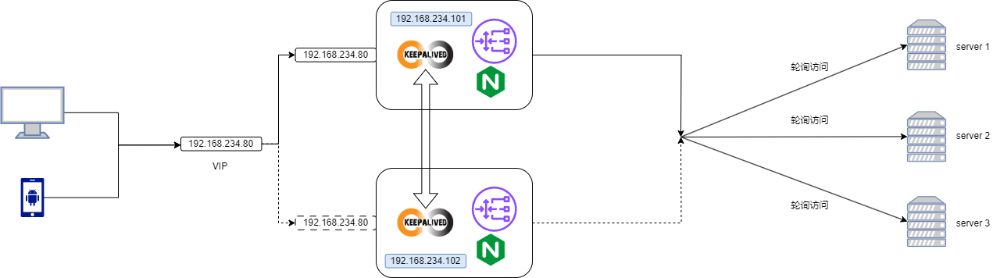

# 多个域名绑定同一台主机指向不同的服务

`app1`和`app2`是在同一台服务器上，使用的端口也是一样的，只是使用的服务不一样（root指向了不同的首页）

> /etc/nginx/conf.d/app1.conf

```bash
server {
    listen       80;
    server_name  app1.com;

    location / {
        root   /data/app1/html;
        index  index.html index.htm;
    }
    error_page   500 502 503 504  /50x.html;
    location = /50x.html {
        root   /usr/share/nginx/html;
    }
}
```

> /etc/nginx/conf.d/app2.conf

```bash
server {
    listen       80;
    server_name  app2.com;

    location / {
        root   /data/app2/html;
        index  index.html index.htm;
    }

    error_page   500 502 503 504  /50x.html;
    location = /50x.html {
        root   /usr/share/nginx/html;
    }
}
```

这里我在windows的hosts文件中把`app1`,`app2`指向了同一台服务器，默认在互联网上的域名解析。
```bash
192.168.234.101 nginx app1.com app2.com
```

# server_name通配符

## 多个域名指向同一个服务

比如`hello1.com`和`hello2.com`想指向同一个服务，可以这样配置。

> /etc/nginx/conf.d/app1.conf

```bash
server {
    listen       80;
    server_name  hello1.com hello2.com;

    location / {
        root   /data/app1/html;
        index  index.html index.htm;
    }

    error_page   500 502 503 504  /50x.html;
    location = /50x.html {
        root   /usr/share/nginx/html;
    }
}
```

这里我在windows的hosts文件中把`hello1.com`,`hello2.com`指向了同一台服务器，默认在互联网上的域名解析。
```bash
192.168.234.101 hello1.com hello2.com
```

## 多个域名指向同一个服务,*号通配符

如果想`a.hello.com`和`b.hello.com`以及其他`xxxx.hello.com`想指向同一个服务，可以这样配置。

> 前缀匹配行不通。。。

> /etc/nginx/conf.d/app1.conf

```bash
server {
    listen       80;
    server_name  *.hello.com;

    location / {
        root   /data/app1/html;
        index  index.html index.htm;
    }

    error_page   500 502 503 504  /50x.html;
    location = /50x.html {
        root   /usr/share/nginx/html;
    }
}
```

如果想`hello.com`和`hello.org`以及其他`hello.xxx`想指向同一个服务，可以这样配置。

> /etc/nginx/conf.d/app1.conf

```bash
server {
    listen       80;
    server_name  hello.*;

    location / {
        root   /data/app1/html;
        index  index.html index.htm;
    }

    error_page   500 502 503 504  /50x.html;
    location = /50x.html {
        root   /usr/share/nginx/html;
    }
}
```

# server_name正则匹配

```bash
server_name ~^[0-9]+\.hello\.com$;
```

# 反向代理到外网

> 通过访问hello.com达到访问baidu.com的效果。

```bash
[root@CentOS7 conf.d]# cat app1.conf 
server {
    listen       80;
    server_name   hello.com;

    location / {
        proxy_pass https://www.baidu.com;
        index  index.html index.htm;
    }
    error_page   500 502 503 504  /50x.html;
    location = /50x.html {
        root   /usr/share/nginx/html;
    }
}
```

# 反向代理到本地其他主机

> 设置代理到192.168.234.102主机

```bash
server {
    listen       80;
    server_name   hello.com;

    location / {
       proxy_pass http://192.168.234.102:8080;
        index  index.html index.htm;
    }
    error_page   500 502 503 504  /50x.html;
    location = /50x.html {
        root   /usr/share/nginx/html;
    }
}
```

# 负载均衡到多台主机

`/etc/nginx/nginx.conf`定义需要负载均衡的机器

```bash
    upstream backend {
        server 192.168.234.102:8080;
        server 192.168.234.103:8080;
        server 192.168.234.104:8080;
    }
```

<details>
  <summary>完整配置</summary>

```bash

user  nginx;
worker_processes  auto;

error_log  /var/log/nginx/error.log notice;
pid        /var/run/nginx.pid;


events {
    worker_connections  1024;
}


http {
    include       /etc/nginx/mime.types;
    default_type  application/octet-stream;

    log_format  main  '$remote_addr - $remote_user [$time_local] "$request" '
                      '$status $body_bytes_sent "$http_referer" '
                      '"$http_user_agent" "$http_x_forwarded_for"';

    access_log  /var/log/nginx/access.log  main;

    sendfile        on;
    #tcp_nopush     on;

    keepalive_timeout  65;

    #gzip  on;

    include /etc/nginx/conf.d/*.conf;

    upstream backend {
        server 192.168.234.102:8080;
        server 192.168.234.103:8080;
        server 192.168.234.104:8080;
    }
}
```
</details>

`/etc/nginx/nginx.d`定义`proxy_pass`上游服务器组。

```bash
server {
    listen       80;
    server_name   hello.com;

    location / {
        proxy_pass http://backend;
        index  index.html index.htm;
    }
    error_page   500 502 503 504  /50x.html;
    location = /50x.html {
        root   /usr/share/nginx/html;
    }
}                                                                                                                          
```

这样即使其中的一个服务器挂机了，依然可以通过其他的代理服务器来在正常工作。

# 负载均衡权重weight

`/etc/nginx/nginx.conf`定义需要负载均衡机器的权重`weight`,没有配置权重的机器默认是1。

```bash
upstream backend {
        server 192.168.234.102:8080 weight=8;
        server 192.168.234.103:8080;
        server 192.168.234.104:8080;
    }
```

# 负载均衡down不参与负载均衡

`/etc/nginx/nginx.conf`定义不需要负载均衡机的器添加关键字`down`,该机器不会被访问，就和挂掉了一样。

```bash
upstream backend {
        server 192.168.234.102:8080 weight=8;
        server 192.168.234.103:8080;
        server 192.168.234.104:8080 down;
    }
```

> 只用102，103服务器可用

# 负载均衡backup设置备用服务器

`/etc/nginx/nginx.conf`定义备用机添加关键字`backup`,只用当其他负载机器不可用的时候才使用该备用机。

```bash
upstream backend {
        server 192.168.234.102:8080 weight=8;
        server 192.168.234.103:8080 backup;
        server 192.168.234.104:8080 down;
    }
```

> 上面的设置只会访问102，当103挂点的时候才会使用103。

# 其他几种不常用负债均衡配置

## ip_hash

> 根据客户端的ip地址转发同一台服务器，可以保持会话。（现实中客户ip会改变）

## least_conn

> 最少连接访问。给负载的机器连接较少的分配请求。

## url_hash

> 根据用户访问的url定向转发请求。


## fair

> 根据后端服务器的响应时间转发请求。

# 使用正则设置动静分离

`192.168.234.101`nginx服务器设置app1.conf文件。
```bash
server {
    listen       80;
    server_name   hello.com;

    location / {
       proxy_pass http://192.168.234.104:8080;
    }

    location ~*/(js|css|images|webfonts|favicon.ico) {
        root   /data/mi/static;
    }
}
```


在`192.168.234.104`服务器上可以将`js|css|images`全部删除，因为在nginx服务器上已经有缓存了。

> 我不清楚是为什么，`html`文件无法代理，虽然我在location里添加了html还是不可以。

# rewrite实现URL重写

rewrite是实现URL重写的关键指令，根据regex(正则表达式)部分内容，重定向到replacement,结尾是flag标记。

rewrite <regex> <replacement>   [flag];
关键字  正则     替代内容    flag标记

rewrite参数的标签段位置:
server,location,if

flag标记说明:
last    #本条规则匹配完成后，继续向下匹配新的location URI规则
break   #本条规则匹配完成即终止，不再匹配后面的任何规则
redirect #返回302临时重定向，浏览器地址会显示跳转后的URL地址
permanent #返回301永久重定向，浏览器地址栏会显示跳转后的URL地址

实例
```bash
location / {
   rewrite ^/([0-9]+).html$ /index.jsp?pageNum=$1 break;
   proxy_pass http://192.168.234.104:8080;
}
```
> 如果访问 http://xxx/2.html 会转发到后台的 http://xxx/index.jsp?pageNum=2

# 设置被代理服务器的防火墙

```bash
# 开启防火墙
systemctl start firewalld
# 设置被代理服务器的8080端口只能被101访问
firewall-cmd --permanent --add-rich-rule="rule family="ipv4" source address="192.168.234.101" port protocol="tcp" port="8080" accept"
# 生效防火墙规则
firewall-cmd --reload
# 删除规则
firewall-cmd --permanent --remove-rich-rule="rule family="ipv4" source address="192.168.234.101" port protocol="tcp" port="8080" accept"
# 关闭防火墙
systemctl stop firewalld
```

# 防盗链

valid_referer | none | blocked | server_names | strings ……;

- none，检测 Referer 头域不存在的情况
- blocked,检测 Referer 头域的值被防火墙或者代理服务器删除或伪装的情况。这种情况该头域的值以“http://" 或"https://" 开头。
- server_names ，设置一个或多个 URL，检测 Referer 头域的值是否是这些 URL 中的某一个。
 
在需要防盗链的location中配置
```bash
valid_referers 192.168.234.101;
if ($invalid_referer){
  return 403;
}
```
> 注意if后面有空格


<details>
  <summary>101完整配置</summary>

```bash
server {
    listen       80;
    server_name   hello.com;

    location / {
       proxy_pass http://192.168.234.104:8080;
    }

    location ~*/(js|css|images|webfonts|favicon.ico|index.html) {
        valid_referers 192.168.234.101;
        if ($invalid_referer){
                return 403;
        }
        root   /data/mi/static;
        index  index.html index.htm;
    }
}
```
</details>

<details>
  <summary>102完整配置</summary>

```bash
server {
    listen       80;
    server_name   nginx2;

    location / {
       proxy_pass http://192.168.234.101:80;
    }
}
```
</details>

> 这样在102无法访问图片等静态资源，只有http头部有Referer http://192.168.234.101/ 才能访问。

如果设置了`valid_referers none 192.168.234.101;`代表没有Referer或有Referer但是server_names必须对才能访问。

# keepalived高可用

## keepalived简单说明

> Keepalived是一个用于实现高可用性的工具，通常用于在多个服务器之间共享虚拟IP地址，确保服务在某台服务器上不可用时能够迅速切换到另一台服务器上。


安装keepalived
```bash
yum install -y keepalived
```

keepalived 常用命令
```bash
# 启动
systemctl start keepalived
# 查看状态
systemctl status keepalived
# 停止
systemctl stop keepalived
```

配置文件
```bash
ll /etc/keepalived/keepalived.conf
```

默认的配置文件
<details>
<summary>详细配置</summary>

```bash
! Configuration File for keepalived

global_defs {
   notification_email {
     acassen@firewall.loc
     failover@firewall.loc
     sysadmin@firewall.loc
   }
   notification_email_from Alexandre.Cassen@firewall.loc
   smtp_server 192.168.200.1
   smtp_connect_timeout 30
   router_id LVS_DEVEL
   vrrp_skip_check_adv_addr
   vrrp_strict
   vrrp_garp_interval 0
   vrrp_gna_interval 0
}

vrrp_instance VI_1 {
    state MASTER
    interface eth0
    virtual_router_id 51
    priority 100
    advert_int 1
    authentication {
        auth_type PASS
        auth_pass 1111
    }
    virtual_ipaddress {
        192.168.200.16
        192.168.200.17
        192.168.200.18
    }
}

virtual_server 192.168.200.100 443 {
    delay_loop 6
    lb_algo rr
    lb_kind NAT
    persistence_timeout 50
    protocol TCP

    real_server 192.168.201.100 443 {
        weight 1
        SSL_GET {
            url {
              path /
              digest ff20ad2481f97b1754ef3e12ecd3a9cc
            }
            url {
              path /mrtg/
              digest 9b3a0c85a887a256d6939da88aabd8cd
            }
            connect_timeout 3
            nb_get_retry 3
            delay_before_retry 3
        }
    }
}

virtual_server 10.10.10.2 1358 {
    delay_loop 6
    lb_algo rr 
    lb_kind NAT
    persistence_timeout 50
    protocol TCP

    sorry_server 192.168.200.200 1358

    real_server 192.168.200.2 1358 {
        weight 1
        HTTP_GET {
            url { 
              path /testurl/test.jsp
              digest 640205b7b0fc66c1ea91c463fac6334d
            }
            url { 
              path /testurl2/test.jsp
              digest 640205b7b0fc66c1ea91c463fac6334d
            }
            url { 
              path /testurl3/test.jsp
              digest 640205b7b0fc66c1ea91c463fac6334d
            }
            connect_timeout 3
            nb_get_retry 3
            delay_before_retry 3
        }
    }

    real_server 192.168.200.3 1358 {
        weight 1
        HTTP_GET {
            url { 
              path /testurl/test.jsp
              digest 640205b7b0fc66c1ea91c463fac6334c
            }
            url { 
              path /testurl2/test.jsp
              digest 640205b7b0fc66c1ea91c463fac6334c
            }
            connect_timeout 3
            nb_get_retry 3
            delay_before_retry 3
        }
    }
}

virtual_server 10.10.10.3 1358 {
    delay_loop 3
    lb_algo rr 
    lb_kind NAT
    persistence_timeout 50
    protocol TCP

    real_server 192.168.200.4 1358 {
        weight 1
        HTTP_GET {
            url { 
              path /testurl/test.jsp
              digest 640205b7b0fc66c1ea91c463fac6334d
            }
            url { 
              path /testurl2/test.jsp
              digest 640205b7b0fc66c1ea91c463fac6334d
            }
            url { 
              path /testurl3/test.jsp
              digest 640205b7b0fc66c1ea91c463fac6334d
            }
            connect_timeout 3
            nb_get_retry 3
            delay_before_retry 3
        }
    }

    real_server 192.168.200.5 1358 {
        weight 1
        HTTP_GET {
            url { 
              path /testurl/test.jsp
              digest 640205b7b0fc66c1ea91c463fac6334d
            }
            url { 
              path /testurl2/test.jsp
              digest 640205b7b0fc66c1ea91c463fac6334d
            }
            url { 
              path /testurl3/test.jsp
              digest 640205b7b0fc66c1ea91c463fac6334d
            }
            connect_timeout 3
            nb_get_retry 3
            delay_before_retry 3
        }
    }
}
```
</details>


这个配置文件的主要部分如下：

1. **全局定义 (global_defs)**: 定义了一些全局的参数，如邮件通知、SMTP服务器、路由ID等。

`notification_email`: 指定通知的邮件地址列表。

`notification_email_from`: 指定发件人的邮件地址。

`smtp_server`: 指定SMTP服务器的地址。

`router_id`: 指定路由器ID。

`vrrp_skip_check_adv_addr`: 跳过检查高可用状态的广播地址。

`vrrp_strict`: 严格模式，如果VRRP组内的优先级不同，不允许共享VIP。

`vrrp_garp_interval` 和 `vrrp_gna_interval`: 控制GARP（Gratuitous ARP）的发送频率。

2. **VRRP实例 (vrrp_instance VI_1)**: 定义了一个VRRP实例。

`state MASTER`: 将该节点设置为VRRP组的MASTER。

`interface eth0`: 使用eth0网卡。

`virtual_router_id 51`: VRRP组的唯一标识。

`priority 100`: 设置节点的优先级。

`advert_int 1`: 设置VRRP广播的间隔。

`authentication`: 指定VRRP的认证方式和密码。

`virtual_ipaddress`: 列出了VIP地址列表。

3. **虚拟服务器定义 (virtual_server)**: 定义了一组虚拟服务器及其相关的真实服务器。

`192.168.200.100 443`: 定义了一个虚拟服务器，监听192.168.200.100:443。

`delay_loop 6`: 设置检测真实服务器的延迟。

`lb_algo rr`: 使用Round Robin算法进行负载均衡。

`lb_kind NAT`: 使用NAT模式。

`persistence_timeout 50`: 设置持久性会话的超时时间。

`protocol TCP`: 指定使用TCP协议。

然后定义了该虚拟服务器的真实服务器列表，每个真实服务器包括IP地址、端口、权重以及检测的配置。

这个配置文件涉及到两个VIP（192.168.200.16、192.168.200.17、192.168.200.18）以及多个虚拟服务器。每个虚拟服务器下面都列有一组真实服务器，用于提供相同服务的冗余节点。其中一些真实服务器使用HTTP GET请求进行健康检查。

## 使用keepalived

100和101主机分别安装keepalived。




101主机keepalived配置
`vim /etc/keepalived/keepalived.conf`

特别需要注意网卡配置**interface ens33**，名字可以通过`ip addr`进行查看。

```bash
! Configuration File for keepalived

global_defs {
   router_id LVS_101
}

vrrp_instance VI_1 {
    state MASTER
    interface ens33
    virtual_router_id 51
    priority 100
    advert_int 1
    authentication {
        auth_type PASS
        auth_pass 1111
    }
    virtual_ipaddress {
        192.168.234.80
    }
    
    track_script {
        check_nginx_health  # 使用下面定义的健康检查脚本
    }
}

# 定义健康检查脚本
vrrp_script check_nginx_health {
    script "/etc/keepalived/check_nginx_health.sh"  # 检查nginx是否存活以及重启nginx
    interval 2                                      # 检查间隔，单位为秒
    weight 2                                        # 权重，用于决定节点状态
}
```

check_nginx_health.sh
```bash
touch check_nginx_health.sh
chmod +x check_nginx_health.sh
```

```bash
#!/bin/bash
counter=$(ps -C nginx --no-heading | wc -l)
if [ "${counter}" = "0" ]; then
    nginx   # 启动nginx
    sleep 2 # 2s后再次检查
    counter=$(ps -C nginx --no-heading | wc -l)
    if [ "${counter}" = "0" ]; then
        systemctl stop keepalived
    fi
fi
```

102主机keepalived配置
`vim /etc/keepalived/keepalived.conf`

```bash
! Configuration File for keepalived

global_defs {
   router_id LVS_102
}

vrrp_instance VI_1 {
    state BACKUP
    interface ens33
    virtual_router_id 51
    priority 50
    advert_int 1
    authentication {
        auth_type PASS
        auth_pass 1111
    }
    virtual_ipaddress {
        192.168.234.80
    }
    
    track_script {
        check_nginx_health  # 使用下面定义的健康检查脚本
    }
}

# 定义健康检查脚本
vrrp_script check_nginx_health {
    script "/etc/keepalived/check_nginx_health.sh"  # 检查nginx是否存活以及重启nginx
    interval 2                                      # 检查间隔，单位为秒
    weight 2                                        # 权重，用于决定节点状态
}
```

!!!试的是只有当其中一个keepalived挂了，另外一个才会生效!!!
