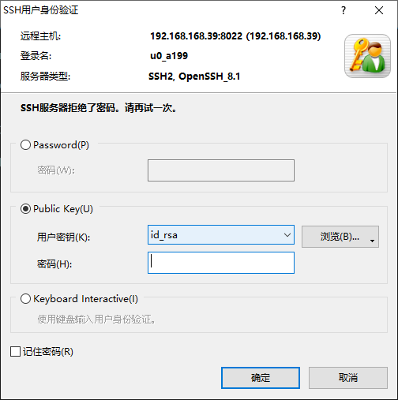

[TOC]

# 1 安装常用命令

## 1.1 安装vim

```
pkg install vim
```

## 1.2 安装openssh

```
pkg install openssh
```

## 1.3 起别名

```
cd ~
vim .alias
```

.alias文件内容

```
alias vi='vim'
alias ll='ls -a'
```

保存后退出

```
vim ./.bashrc
```

添加内容

```
if [ -f ~/.alias ]; then
. ~/.alias
fi
```

重新加载.bashrc文件

```
source ~/.bashrc
```


# 2、通过电脑连接手机termux

一、电脑端操作

1、cmd生成公钥、私钥

> ssh-keygen -t rsa

在`C:\Users\用户名\.ssh\`有生成的公钥`id_rsa.pub`、私钥`id_rsa`

2、把id_rsa.pub公钥文件传输到你的手机根目录下。

二、手机端操作

1、在termux上安装openssh，输入`pkg install openssh`。

2、为了Termux能读出我们手机上的根目录下，需要执行`termux-setup-storage`命令。现在我们的根目录就被映射到了~/storage/shared。

3、然后我们通过cat命令把根目录的公钥文件内容写到authorized_keys文件里，执行如下命令，`cat ~/storage/shared/id_rsa.pub >> ~/.ssh/authorized_keys`。

4、上面三部操作完之后现在可以启动手机上ssh服务了，执行`sshd`命令。

5、接下来查看手机的ip地址，输入`ifconfig`，可以看到你手机的ip地址形如192.168.1.2，记下来。

6、再查看Termux用户名，输入`whoami`，能看到形如u0_a82，就是你的用户名，记下来。

三、继续回到电脑上操作：

1、通过xshell或其他ssh工具连接到刚才的ip地址，选择我们刚才生成的私钥。端口默认为8022，密码不用输入。




