# 资源

| 资料     | 地址                                                     |
| -------- | -------------------------------------------------------- |
| 视频     | https://www.bilibili.com/video/BV1Wu411B72F              |
| 资源下载 | https://pan.baidu.com/s/1uPYypGdNiUidlQbn5176bA?pwd=link |
| 书籍     | 《汇编语言（第四版）》王爽                               |

# 8086微处理器

## 寄存器

8086微处理器的寄存器是计算机处理器中非常重要的部分，用于存储数据、地址和状态信息。8086寄存器可以分为以下几类：

### 1. **通用寄存器 (General-Purpose Registers)**

这些寄存器可以存储数据或地址，它们通常可以被分成高字节和低字节使用。

- **AX (Accumulator Register)**
  - **高字节**：AH (Accumulator High)
  - **低字节**：AL (Accumulator Low)
  - **作用**：主要用于算术运算、逻辑运算和数据传输。
- **BX (Base Register)**
  - **高字节**：BH (Base High)
  - **低字节**：BL (Base Low)
  - **作用**：主要用于基址寻址模式，可以作为指针寄存器使用。
- **CX (Count Register)**
  - **高字节**：CH (Count High)
  - **低字节**：CL (Count Low)
  - **作用**：主要用于循环控制（例如LOOP指令）和字符串操作。
- **DX (Data Register)**
  - **高字节**：DH (Data High)
  - **低字节**：DL (Data Low)
  - **作用**：用于乘法、除法指令时，存储额外的数据；也可以作为端口地址的存储。

### 2. **指针寄存器 (Pointer Registers)**

这些寄存器主要用于存储内存地址。

- **SP (Stack Pointer)**

  - **作用**：指向栈顶，栈的地址是由SS（栈段寄存器）和SP组合确定的。
- **BP (Base Pointer)**

  - **作用**：主要用于基址寻址模式，通常用于访问栈中的数据。

  > mov ax,[bp]  ; = mov ax,ss:[bp]
- **SI (Source Index)**

  - **作用**：在字符串操作中作为源数据的地址指针。
- **DI (Destination Index)**

  - **作用**：在字符串操作中作为目的数据的地址指针。

### 3. **段寄存器 (Segment Registers)**

这些寄存器用于存储内存段的基址，每个段寄存器与特定的内存区域相关联。

- **CS (Code Segment)**

  - **作用**：存储代码段的基址，用于指示当前执行的指令所在的段。

- **DS (Data Segment)**

  - **作用**：存储数据段的基址，用于指示程序的数据区域。

  > mov ax,[bx] ; = mov ax,ds[bx]

- **SS (Stack Segment)**

  - **作用**：存储栈段的基址，用于栈操作。

- **ES (Extra Segment)**

  - **作用**：通常用于额外的数据段，尤其是在字符串操作中配合DI寄存器使用。

### 4. **指令指针寄存器 (Instruction Pointer Register)**

- **IP (Instruction Pointer)**
  - **作用**：指向下一条将要执行的指令的地址。`IP` 寄存器与 `CS`（代码段寄存器）组合，形成当前执行指令的内存地址。每次执行完一条指令后，`IP` 会自动更新，指向下一条指令。

### 5. **标志寄存器 (Flags Register)**

> 标志寄存器（Flags Register）也称为**PSW**（Program Status Word）。PSW寄存器的全称为**程序状态字**（Program Status Word）

- **作用**：存储各种状态标志和控制标志，这些标志反映了算术运算和逻辑运算的结果或控制处理器的某些功能。

主要的标志包括：

- **CF (Carry Flag)**：进位标志，表示上一次运算的进位或借位。
- **ZF (Zero Flag)**：零标志，当运算结果为零时置位。
- **SF (Sign Flag)**：符号标志，表示结果的符号（正或负）。
- **OF (Overflow Flag)**：溢出标志，表示有符号运算是否溢出。
- **PF (Parity Flag)**：奇偶标志，表示运算结果中1的个数是奇数还是偶数。
- **AF (Auxiliary Carry Flag)**：辅助进位标志，在执行加法或减法操作时，监视低半字节之间是否产生了进位或借位。
- **DF (Direction Flag)**：方向标志，控制字符串操作的方向（增大或减小）。
- **IF (Interrupt Flag)**：中断标志，控制是否响应外部中断。

| 标志 | 值为1 | 值为0 | 意义                      |
| ---- | ----- | ----- | ------------------------- |
| OF   | OV    | NV    | 溢出                      |
| DF   | DN    | UP    | 方向                      |
| SF   | NG    | PL    | 符号（Positive/Negative） |
| ZF   | ZR    | NZ    | 零值                      |
| PF   | PE    | PO    | 奇偶 (odd/even)           |
| CF   | CY    | NC    | 进位                      |

标志寄存器（16位）：

| 15   | 14   | 13   | 12   | 11   | 10   | 9    | 8    | 7    | 6    | 5    | 4    | 3    | 2    | 1    | 0    |
| ---- | ---- | ---- | ---- | ---- | ---- | ---- | ---- | ---- | ---- | ---- | ---- | ---- | ---- | ---- | ---- |
|      |      |      |      | OF   | DF   | IF   | TF   | SF   | ZF   |      | AF   |      | PF   |      | CF   |

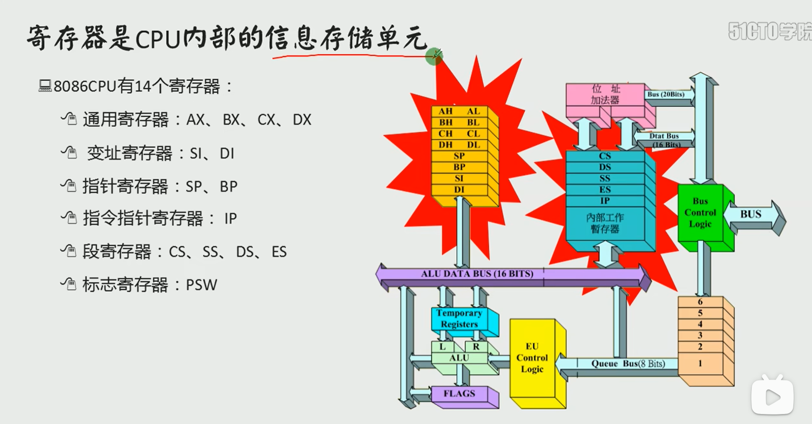

 # 操作码

### **1. 指令（Instruction）/ 操作码（Opcode）**

指令或操作码是汇编语言中的基础操作符，用于执行特定的任务。它们通常对应于CPU的一条机器指令，直接操作寄存器、内存或处理数据。每个指令对应一个特定的操作，常见的指令类别包括：

- **数据传输指令**：

  - **MOV**: 数据传输指令，将数据从一个位置移动到另一个位置。
  - **PUSH**: 将数据压入堆栈。
  - **POP**: 从堆栈中弹出数据。

- **算术指令**：

  - **ADD**: 加法指令，将两个操作数相加。

  - **SUB**: 减法指令，将一个操作数从另一个操作数中减去。

  - **MUL**: 乘法指令，执行无符号乘法。

  - **DIV**: 除法指令，执行无符号除法。

  - **INC**（**Increment**）：加法指令，将目标操作数的值加1。常用于循环计数器、指针操作等。
    - 例如：`INC AX` 会将寄存器`AX`中的值加1。

  - **DEC**（**Decrement**）：减法指令，将目标操作数的值减1。通常与`INC`配对使用。

    - 例如：`DEC BX` 会将寄存器`BX`中的值减1。

  - **NEG**（**Decrement**）：取反操作，将操作数取反（即变为其二进制补码）。
    - 例如：`NEG AX` 会将`AX`中的值变为其负值。

- **逻辑指令**：

  - **AND**: 逻辑与操作。
  - **OR**: 逻辑或操作。
  - **XOR**: 逻辑异或操作。
  - **NOT**: 逻辑非操作。

- **控制流指令**：

  - **JMP**: 无条件跳转。
  - **JE/JZ**: 如果相等/如果零则跳转。
  - **JNE/JNZ**: 如果不相等/如果非零则跳转。
  - **CALL**: 调用子程序。
  - **RET**: 从子程序返回。

- **位操作指令**：

  - **SHL**: 左移位操作。
  - **SHR**: 右移位操作。
  - **ROL**: 循环左移操作。
  - **ROR**: 循环右移操作。

- **系统指令**：

  - **INT**: 触发中断，调用操作系统服务。
  - **NOP**: 无操作指令，什么都不做但消耗一个周期。
  - **HLT**: 停机指令，停止处理器。

### 2. **伪指令（Pseudo-instructions）**

伪指令不直接对应于机器代码，但它们在汇编过程中提供了辅助功能。它们通常用于定义数据、分配存储空间、控制段和程序流程等。常见的伪指令包括：

- **DB**: 定义字节，用于在内存中定义一个或多个字节的数据。
- **DW**: 定义字，用于定义一个或多个字的（16位）数据。
- **DD**: 定义双字，用于定义一个或多个双字的（32位）数据。
- **SEGMENT**: 定义一个段。
- **ENDS**: 结束一个段的定义。
- **EQU**: 为符号分配一个常量值。
- **ORG**: 设置程序的起始地址。

### 3. **指令前缀（Instruction Prefixes）**

在某些情况下，可以使用前缀来修改指令的行为。常见的指令前缀包括：

- **REP**: 用于字符串操作指令，重复执行指令直到满足特定条件。
- **LOCK**: 用于多处理器系统中，确保指令在锁定期间不被其他处理器干扰。

### 4. **标识符（Identifiers）**

标识符是用户定义的名称，用来表示变量、常量、内存地址、寄存器或代码标签。它们不是关键字，但在汇编过程中非常重要。


# Debug使用

## 常用指令

### **R命令**（**R**egisters）：

 - **作用**：查看或修改CPU寄存器的内容。

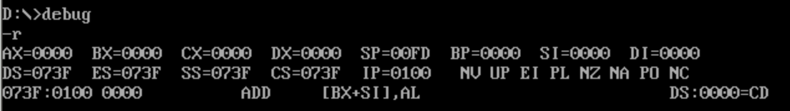

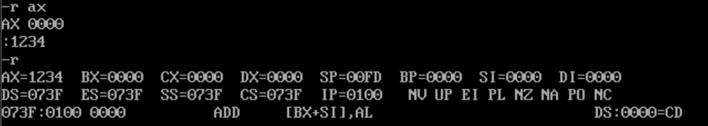

> `rax`也可以，不用加空格。

### **D命令**（**D**ump Memory）：

 - **作用**：查看内存中的内容，以十六进制和ASCII格式显示。

> 列出预设地址 ( `CS:IP`代码段寄存器:指令指针寄存器 ) 内存处的128个字节的内容，每一行是8个字节。

```deb
d
```

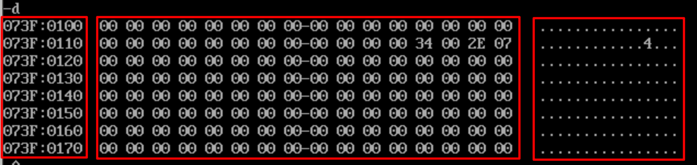

左侧为`段地址:偏移地址`表示的物理地址，中间是十六进制的数据，右侧数据的ASCII格式。

> 再次输入`d`查看内存内容，调试器会记住上一次的内存地址作为预设地址。

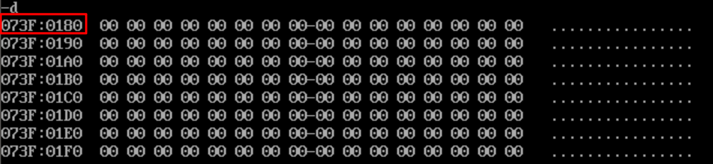

> 查看指定内存地址的内容

```debug
d 段地址:偏移地址
```

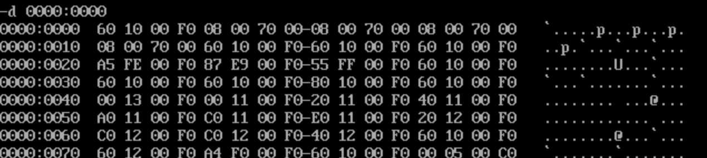

> 查看指定内存地址范围的内容

```de&#39;bu
d 段地址:偏移地址 结尾偏移地址
```

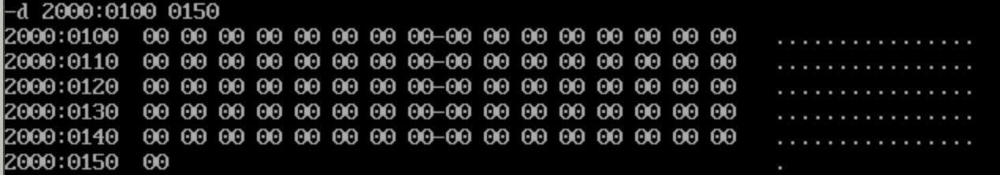

### **E命令**（**E**nter Memory）：

 - **作用**：修改内存中的内容，以十六进制格式输入数据。

> 修改指定内存中的数据

```debug
e 段地址:偏移地址 数据1 数据2 ...
```

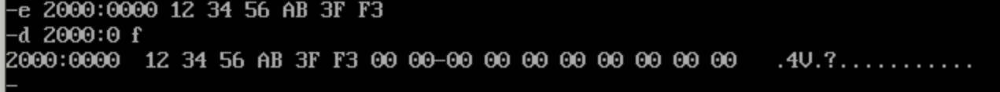

> 逐个询问式修改
>
> 空格-接受，继续
>
> 回车-结束

```
e 段地址:偏移地址
```

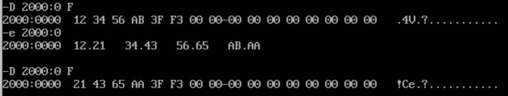

### **U命令**（**U**nassemble）：

 - **作用**：将内存中的机器指令翻译成对应的汇编指令。

有如下的汇编代码和对应的机器：

```assembly
mov ax,0123
mov bx,0003
mov ax,bx
add ax,bx

--对应的机器码--
B8 23 01 
BB 03 00
89 D8
01 D8
```

先用`E`命令将机器码写入指定的内存，再使用`D`进行内存查看，最后使用`U`命令查看机器码对应的代码。

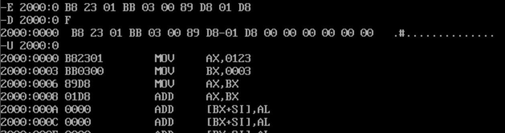

### **A命令**（**A**ssemble）：

 - **作用**：在内存中以汇编指令的格式写入机器指令。

有如下的汇编代码和对应的机器：

```assembly
mov ax,0123
mov bx,0003
mov ax,bx
add ax,bx

--对应的机器码--
B8 23 01 
BB 03 00
89 D8
01 D8
```

先用`A`命令将汇编指令写入内存，`D`命令查看数据，最后`U`命令查看反编译的汇编代码

```assembly
A 段地址:偏移地址
```

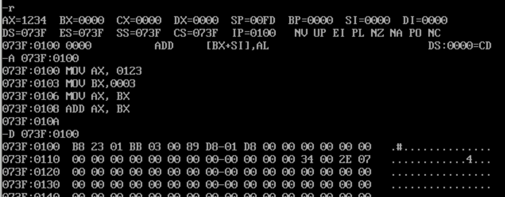

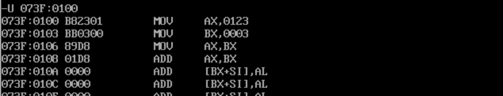

### **T命令**（**T**race）：

 - **作用**：逐条执行机器指令，并显示每条指令执行后的状态。

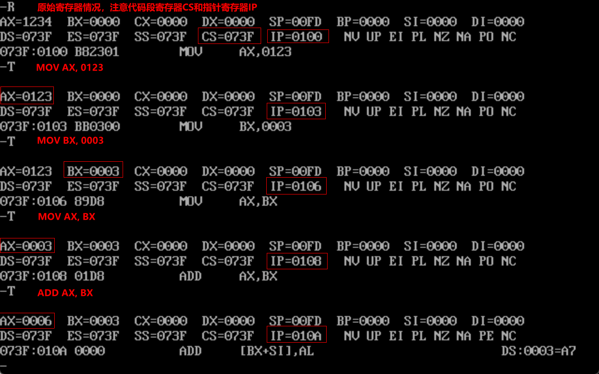

### **Q命令**（**Quit**）：

退出Debug

## JMP 指令

`jmp` 指令用于**无条件跳转**到程序中的另一个位置。当执行 `jmp` 指令时，CPU 会将程序计数器（即指令指针）设置为指令中指定的目标地址，从而直接跳转到该地址处继续执行代码。

`jmp` 指令通常用于以下情况：

1. **循环控制**：可以用来实现简单的循环结构，通过跳转到循环的起始位置来重复执行某段代码。
2. **条件跳转后的处理**：在执行条件跳转指令之后，如果需要跳过某些代码，`jmp` 可以用来无条件地跳过那些不需要执行的指令。
3. **跳转表**：通过 `jmp` 指令实现跳转表（如 `switch-case` 结构），根据某些条件跳转到不同的代码块。
4. **跳过错误处理**：在错误处理或异常处理中，如果不需要执行某些代码，可以用 `jmp` 指令跳过这些代码块。

下面是一个跳转的程序，实现的循环：

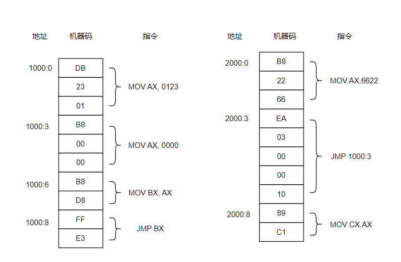

先使用`A`在1000:0位置和2000:0位置写入如下汇编：

```assembly
-A 1000:0

MOV AX, 0123
MOV AX, 0000
MOV BX, AX
JMP BX

-A 2000:0
MOV AX,6622
JMP 1000:3
MOV CX,AX
```

现在要求程序在2000:0处开始执行，下面我们分析下代码：

1. 2000:0 `MOV AX, 6622`  # 寄存器AX被写入6633，IP变为3，下一步执行2000:3
2. 2000:3 `JMP 1000:3` # **跳转到1000:3**，CS改为1000，IP改为3，下一步执行1000:3
3. 1000:3 `MOV AX,0`  # AX改为0，IP改为6，下一步执行1000:6
4. 1000:6 `MOV BX,AX` # BX改为0，IP改为8，下一步执行1000:8 （MOV BX,AX指令占两个字节，没有操作数）
5. 1000:8 `JMP BX` # 因为JMP在第四步被改为了0，所以这里IP改为0，下一步执行1000:0
6. 1000:0 `MOV AX, 0123` #  AX改为0，IP改为3，下一步执行1000:3， **跳转到第3步进入循环**

**Debug测试：**

先修改CS和IP的值，让程序可以在2000:0处开始执行:

```
RCS
2000

RIP
0
```

使用`T`查看程序运行每一步后的寄存器信息

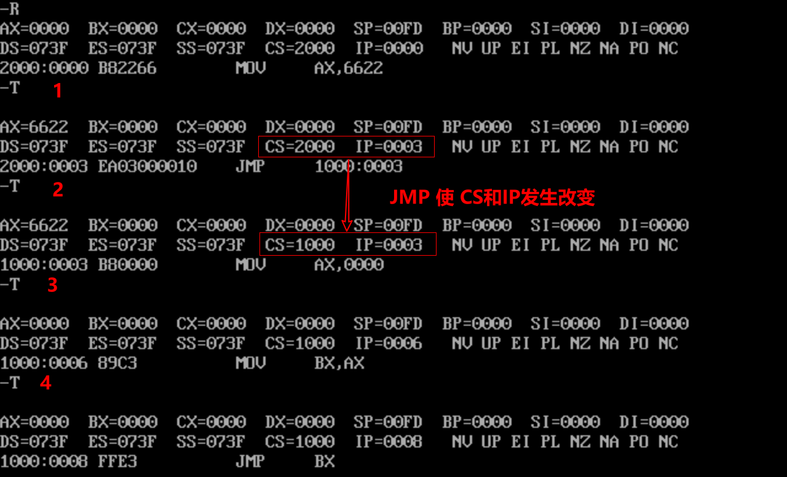

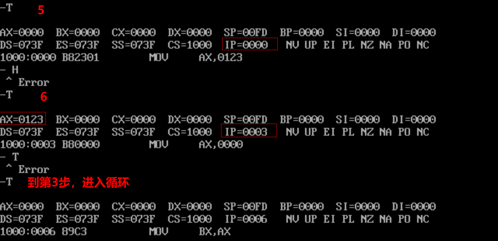

## DS寄存器

DS寄存器和[address]配合使用读取内存中的数据

> `DS`数据段（Data Segment），`[address]`表示的是偏移地址

现在如果内存有如下的数据：

| 内存地址 | 数据 |
| -------- | ---- |
| 1000:0   | 23   |
| 1000:1   | 11   |
| 1000:2   | 22   |
| 1000:3   | 66   |

另外有如下的汇编指令：

```assembly
MOV AX,1000	; 将1000，存入AX寄存器
MOV DS,AX	; 即AX中的数据（1000），存入DS数据段基址，DS=1000
MOV AX,[0]	; 将DS数据段基址加上偏移0后的地址（即1000:0）中的字型数据1123H，存入AX寄存器，AX=1123
MOV BX,[2]	; 将DS数据段基址加上偏移2后的地址（即1000:2）中的字型数据6622，存入BX寄存器，BX=6622
MOV CX,[1]	; 将DS数据段基址加上偏移1后的地址（即1000:1）中的字型数据2211，存入CX寄存器，CX=2211
ADD BX,[1]	; 将DS:[1]中的字型数据（2211）加上BX中的数据（6622）后再存入BX中，BX=8833
ADD CX,[2]	; 将DS:[2]中的字型数据（6622）加上CX中的数据（2211）后再存入CX中，CX=8833
```

### 测试

先用`E`命令将数据写入内存1000:0

```assembly
E 1000:0 23 11 22 66	；写入数据
D 1000:0 F	;查看写入的数据
```

再是使用`A`命令将汇编程序写入内存

```
A
MOV AX,1000
MOV DS,AX
MOV AX,[0]
MOV BX,[2]
MOV CX,[1]
ADD BX,[1]
ADD CX,[2]
```


`R`命令查看各个寄存器的情况，并使用`T`命令查看程序的执行

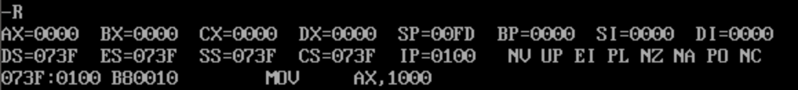

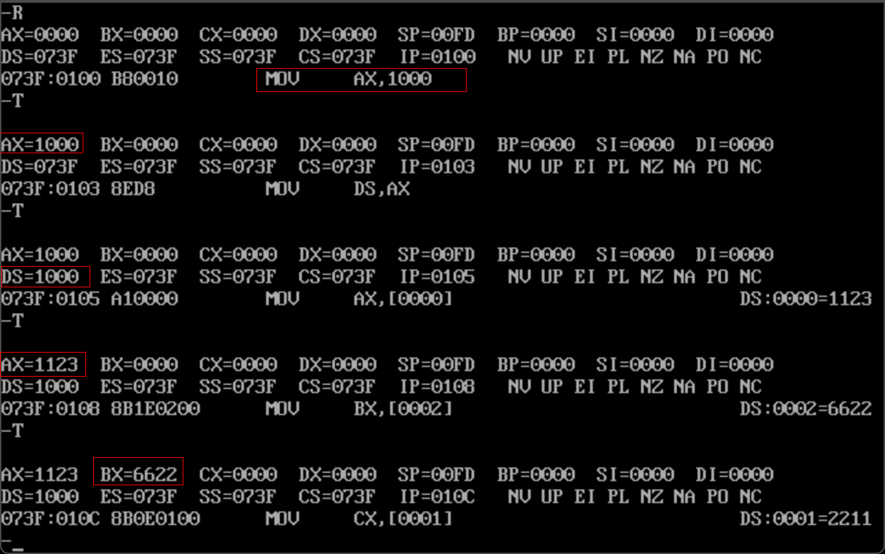

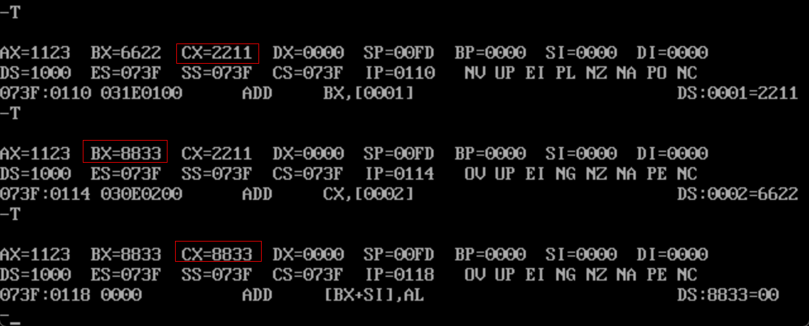

## 栈和栈操作

8086CPU提供的栈操作机制：在SS，SP中存放栈顶的段地址和偏移地址，入栈和出栈指令根据SS:SP指示的地址，按照栈的方式访问内存单元。

**push指令的执行步骤：**
1）SP=SP-2；

2）向SS:SP指向的字单元中送入数据。

**pop指令的执行步骤：**
1）从SS:SP指向的字单元中读取数据；

2）SP=SP-2。

例子：设将10000H~1000FH内存当作栈来使用。

> 将AX、BX、CX分别入栈，最后把栈的数据弹出到AX、BX、CX，最后的结果是实现了AX和CX的数据交换。

```assembly
MOV AX,0123
MOV BX,2266
MOV CX,1122
PUSH AX
PUSH BX
PUSH CX
POP AX
POP BX
POP CX
```

注意，CPU无法控制栈是否越界，需要程序员自己控制。

# MASM

> MASM（Microsoft Macro Assembler）是微软开发的一款汇编语言编译器，用于编写和编译 x86 汇编代码。

## 编写代码

编写如下的汇编代码，可以使用edit.exe或其他编辑器，命名为add.asm

```asm
assume cs:codesg
codesg segment
start: MOV AX,0123
       MOV BX,0456
       ADD AX,BX
       ADD AX,BX

       MOV AX,4C00h
       INT 21h
codesg ends
end start
```

其中代码中如下的为伪指令

> 没有对应的机器码的指令，最终不被CPU所执行。

```assembly
assume cs:codesg
codesg segment
……
codesg ends
end start
```

## 编译

> 用于将汇编源文件编译为目标文件obj

```
masm add.asm
或者
masm add.asm;
```

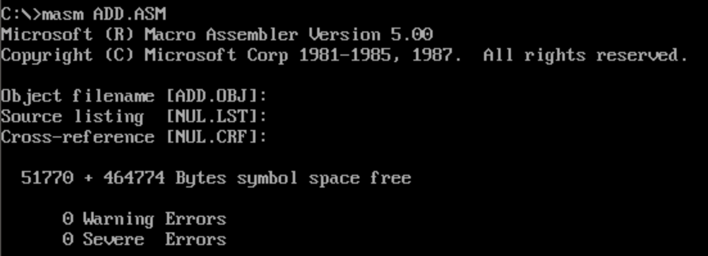

## 链接

> 编译后，你需要使用 `LINK.EXE` 将目标文件（`.obj`）链接成可执行文件。

例如：

```
link add.obj
```

这将生成一个可执行文件（`.exe`）。

## debug程序

### debug

```
debug add.exe
```

查看寄存器并反编译

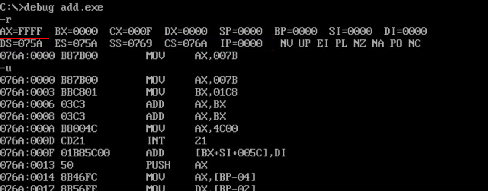

- CS:IP是代码存放的位置。

- CX存放的是代码的长度

可以使用`T`指令运行汇编代码。或者使用`P`（Proceed），`G`（Go）指令来运行。

### P指令

> `P`（Proceed）指令类似T指令，逐条执行指令、显示结果。但遇子程序、中断等时，直接执行，然后显示结果。

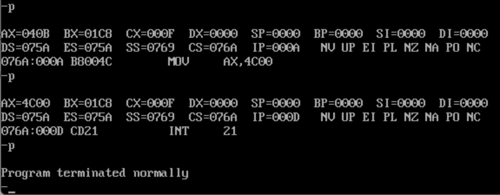

### G指令

> `G`（Go）指令从指定地址处开始运行程序，知道遇到断点或程序正常结束。

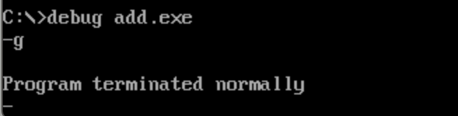

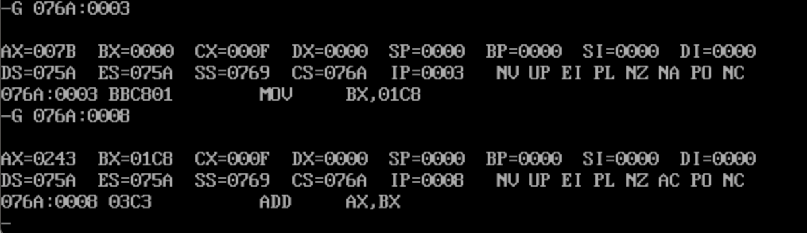


# LOOP循环

### 从1加到10

```assembly
assume cs:codesg
codesg segment
	MOV AX,0
	MOV CX,10
S:	ADD AX,1
	LOOP S
	
     MOV AX,4C00h
     INT 21h
codesg ends
end
```

**LOOP S**：这个指令会先将 `CX` 寄存器的值减 1，然后检查 `CX` 是否为 0。如果 `CX` 不为 0，则跳转到标签 `S:` 所在的指令（即 `ADD AX,1`）继续执行循环。如果 `CX` 为 0，循环结束，程序继续执行后续指令。

相当于do……while循环

### 内存中的一个字节数据*3

```
assume cs:codesg
codesg segment
	MOV AX,0ffffH
	MOV DS,AX	; DS=FFFFH
	MOV BX,6	; 内存地址的偏移
	MOV AL,[BX]	; 取内存中的值
	MOV AH,0	; 高位清零
	MOV DX,0	; 存和
	MOV CX,3	; 循环次数
S:	ADD DX,AX
	LOOP S
	
     MOV AX,4C00h
     INT 21h
codesg ends
end
```

### 段前缀使用

> 将内存ffff:0\~ffff:b中的数据拷贝到0:200\~0:20b单元中。

```
assume cs:codesg
codesg segment
	MOV AX,0ffffH
	MOV DS,AX
	MOV AX,0020H
	MOV ES,AX
	
	MOV BX,0
	MOV CX,12
S:	MOV DL,DS:[BX]
	MOV ES:[BX],DL
	INC BX
	LOOP S
	
     MOV AX,4C00h
     INT 21h
codesg ends
end
```

### 累加一段定义好的数据

不推荐在代码里直接写地址，就有了下面的代码

```
assume cs:codesg
codesg segment
	DW 0012H,0045H,0789H,0abcH,0defH,0fedH,0cbaH,0987H
	
start:	MOV BX,0	;start定义程序开始的位置
		MOV AX,0
		MOV CX,8
	S:	ADD AX,CS:[BX]
		ADD BX,2
	
     MOV AX,4C00h
     INT 21h
codesg ends
end start	;定义程序结束的位置
```

**dw** (define word): 定义一个字型数据

**db** (Define Byte) : 定义一个字节

**dd** (Define Doubleword)：定义一个双字

### 内存数据反转

通过栈操作和LOOP实现内存数据的反转，中间预留了一部分

```assembly
assume cs:codesg
codesg segment
	DW 0123H,0456H,0789H,0abcH,0defH,0fedH,0cbaH,0987H
	DW 0,0,0,0,0,0,0,0,0,0,0,0,0,0,0,0
	
start:	MOV AX,CS
		MOV SS,AX
		MOV SP,30H	;这个给了48字节的空间，如果给32字节会出错
		MOV BX,0
		MOv CX,8
	S:	PUSH CS:[BX]
		ADD BX,2
		LOOP S
		
		MOV BX,0
		MOV CX,8
	S0:	POP CS:[BX]
		ADD BX,2
		LOOP S0
		
     MOV AX,4C00h
     INT 21h
codesg ends
end start
```

### 内存数据反转（数据、栈、代码放入不同段）

> 上一个例子中数据、栈、代码都是放在的代码段中，下面的例子把他们分开

```assembly
assume cs:code,ds:data,ss:stack
data segment
	DW 0123H,0456H,0789H,0abcH,0defH,0fedH,0cbaH,0987H
stack segment
	DW 0,0,0,0,0,0,0,0,0,0,0,0,0,0,0,0
code segment
start:	MOV AX,stack
		MOV SS,AX
		MOV SP,20H
		MOV AX,data
		MOV DS,AX
		
		MOV BX,0
		MOv CX,8
	S:	PUSH [BX] ; =PUSH DS:[BX]
		ADD BX,2
		LOOP S
		
		MOV BX,0
		MOV CX,8
	S0:	POP [BX]	; =POP DS:[BX]
		ADD BX,2
		LOOP S0
		
     MOV AX,4C00h
     INT 21h
code ends
end start
```

# 内存寻址方式

## 处理字符串问题

> 大小写转换

```assembly
assume cs:code,ds:data
data segment
	db 'BaSic'
	db 'iNforMatiOn'
code segment
start:	MOV AX,data
		MOV DS,AX
		; to uppercase
		MOV BX,0
		MOV CX,5
	S:	MOV AL,[BX]
		AND AL,11011111b
		MOV [BX],AL
		INC BX
		LOOP S
		; to lowercase
		MOV BX,5
		MOV CX,11
	S0:	MOV AL,[BX]
		OR AL,00100000b
		MOV [BX],AL
		INC BX
		LOOP S0
		
     MOV AX,4C00h
     INT 21h
code ends
end start
```

利用大小写字母的关系，进行与、或运算后进行大小写转换。

## [bx+idata]的含义

- [bx+idata]表示一个内存单元，它的偏移地址为(bx)+idata（bx中的数值加上idata）

- mov ax,[bx+200]/mov ax,[200+bx]的含义
  - 将一个内存单元的内容送入ax
  - 这个内存单元的长度为2字节（字单元），存放一个字
  - 内存单元的段地址在ds中，偏移地址为200加上bx中的值
  - 数学化的描述为：（ax）= （(dx)*16+200+(bx)）
- 指令mov ax,[bx+200]的其他写法（常用）
  - mov ax,[200+bx]
  - mov ax,200[bx]
  - mov ax,[bx].200

> 大小写转换，采用[bx+idata]的写法，不过要求两个字符串长度一致

```
assume cs:code,ds:data
data segment
	db 'BaSic' 	; to uppercase
	db 'MinIX'	; to lowercase
code segment
start:	MOV AX,data
		MOV DS,AX
		
		MOV BX,0
		MOV CX,5
	S:	MOV AL,[BX]
		AND AL,11011111b
		MOV [BX],AL
		MOV AL,[BX+5]
		OR AL,00100000b
		MOV [BX+5],AL
		INC BX
		LOOP S
		
     MOV AX,4C00h
     INT 21h
code ends
end start
```

## SI和DI寄存器

> 用寄存器SI和DI实现将字符串'welcome to masm!'复制到它后面的数据区中。

```assembly
assume cs:code,ds:data
data segment
	db 'welcome to masm!' 	; source
	db '................'	; destination
code segment
start:	MOV AX,data
		MOV DS,AX
		
		MOV SI,0	; 源数据的地址指针
		MOV DI,16	; 目的数据的地址指针
		MOV CX,8
	S:	MOV AX,[SI]	; = MOV AX,DS:[SI]
		MOV [DI],AX	; = MOV DS:[DI],AX
		ADD SI,2
		ADD DI,2
		LOOP S
		
     MOV AX,4C00h
     INT 21h
code ends
end start
```

## [bx+si]和[bx+di]方式寻址

- [bx+si]表示一个内存单元

  - 偏移地址为(bx)+(si) (即bx中的数值加上si中的数值)。

- 指令mov ax,[bx+si]的含义

  - 将一个内存单元的内容送入ax
  - 这个内存单元的长度为2字节(字单元)，存放一字

  - 偏移地址为bx中的数值加上si中的数值

  - 段地址在ds中

- 指令mov ax,[bx+si]的数学化的描述

  - (ax)=((ds)*16+(bx)+(si)) 
- mov ax,[bx+si]的其他写法

  - mov ax,[bx]\[si]

## [bx+si+idata]和[bx+di+idata]方式寻址

## 不同的寻址方式的灵活应用

| 形式          | 名称             | 特点                         | 意义                                               | 示例                          |
| ------------- | ---------------- | ---------------------------- | -------------------------------------------------- | ----------------------------- |
| [idata]       | 直接寻址         | 用一个常量/变量来表示地址    | 用于直接定位一个内存单元                           | mov ax,[200]                  |
| [bx]          | 寄存器间接寻址   | 用一个变量来别是内存地址     | 用于间接定位一个内存单元                           | mov bx,0<br />mov ax,[bx]     |
| [bx+idata]    | 寄存器相对寻址   | 用一个变量和常量表示地址     | 可在一个起始地址的基础上用变量间接定位一个内存单元 | mov bx,4<br />mov ax,[bx+200] |
| [bx+si]       | 基址变址寻址     | 用两个变量表示地址           |                                                    | mov ax,[bx+si]                |
| [bx+si+idata] | 相对基址变址寻址 | 用两个常量和一个变量表示地址 |                                                    | mov ax,[bx+si+200]            |

案例1：将data段中每个单词的头一个字母改为大写字母。

```assembly
assume cs:code,ds:data
data segment
	db '1.file          '
	db '2.edit          '
	db '3.search        '
	db '4.view          '
	db '5.option        '
	db '6.help          '
	
code segment
start:	MOV AX,data
		MOV DS,AX
		
		MOV BX,0
		MOV CX,6
	S:	MOV AL,[BX+2]
		AND AL,11011111b
		MOV [BX+2],AL
		ADD BX,16
		LOOP S
		
     MOV AX,4C00h
     INT 21h
code ends
end start
```

案例2：将data段中每个单词的都改为大写字母。

```assembly
assume cs:code, ds:data, ss:stack

data segment
	db 'ibm             '
	db 'dec             '
	db 'dos             '
	db 'vax             '
data ends

stack segment
	dw 0,0,0,0,0,0,0,0 ; 定义一个简单的堆栈，大小为16字节
stack ends	
	
code segment
start:	
	; 初始化数据段寄存器 DS 和堆栈段寄存器 SS
	MOV AX,data
    MOV DS,AX
    MOV AX,stack
    MOV SS,AX
    MOV SP,16

    MOV AX,0
    MOV BX,0
    MOV CX,4
S0:	
	PUSH CX
    MOV SI,0
    MOV CX,3
S: 
	MOV AL,[BX+SI]
    AND AL,11011111b
    MOV [BX+SI],AL
    INC SI
    LOOP S
    ADD BX,16
    POP CX
    LOOP S0
		
	MOV AX,4C00h
	INT 21h
code ends
end start
```

## word ptr和byte ptr使用

`WORD PTR` 和 `BYTE PTR` 是汇编语言中用于指定操作数的大小（字节数）的操作符，`PTR` 是 "Pointer"（指针）的缩写。当我们在汇编程序中访问内存时，汇编器通常无法直接确定我们是要访问一个字节（8 位）、一个字（16 位）还是一个双字（32 位）。因此，我们使用 `BYTE PTR`、`WORD PTR` 等来明确告诉汇编器操作数的大小。

1. `BYTE PTR`

`BYTE PTR` 用于指示我们正在操作一个字节（8 位）。

**示例：**

```assembly
MOV AL, BYTE PTR [SI]     ; 从内存中读取一个字节到 AL 寄存器
MOV BYTE PTR [DI], AL     ; 将 AL 寄存器中的一个字节存储到内存中
```

在这些指令中，`BYTE PTR` 明确指定操作的是一个字节，这样汇编器就知道要如何生成相应的机器码。

2. `WORD PTR`

`WORD PTR` 用于指示我们正在操作一个字（16 位）。

**示例：**

```
assembly
复制代码
MOV AX, WORD PTR [SI]     ; 从内存中读取一个字（16 位）到 AX 寄存器
MOV WORD PTR [DI], AX     ; 将 AX 寄存器中的一个字存储到内存中
```

在这些指令中，`WORD PTR` 明确指定操作的是一个字，这样汇编器知道要读取或写入 16 位的数据。

## 用div指令实现除法

- div是除法指令，使用div作除法的时候
  - 被除数：（默认）放在AX或DX和AX中
  - 除数：8位或16位，在寄存器或内存单元中
  - 结果：AL（商）AH（余数），AX（商）DX（余数）

| 被除数 | AX              | DX和AX           |
| ------ | --------------- | ---------------- |
| 除数   | 8位内存或寄存器 | 16位内存或寄存器 |
| 商     | AL              | AX               |
| 余数   | AH              | DX               |

- div指令格式
  - div 寄存器
  - div 内存单元

| 示例指令               | 被除数           | 除数             | 商   | 余数 |
| ---------------------- | ---------------- | ---------------- | ---- | ---- |
| div bl                 | (ax)             | (bl)             | (al) | (ah) |
| div byte ptr ds:[0]    | (ax)             | ((ds)*16+0)      | (al) | (ah) |
| div byte ptr [bx+si+8] | (ax)             | ((ds)*16+(si)+8) | (al) | (ah) |
| div bx                 | (dx)*10000H+(ax) | (bx)             | (ax) | (dx) |
| div word ptr ds:[0]    | (dx)*10000H+(ax) | ((ds)*16+0)      | (ax) | (dx) |
| div word ptr [bx+si+8] | (dx)*10000H+(ax) | ((ds)*16+(si)+0) | (ax) | (dx) |

**示例：**利用除法指令计算100001/100.

分析：

100001D=186A1H，需要两个寄存器。DX=1H, AX=86A1H

100D = 64H，使用BX作除数，BX=64H

商在AX中，余数在DX中。

100001/100 = 1000……1

186A1H/64H = 3E8H……1

汇编

```assembly
A ;输入指令
MOV DX,1
MOV AX,86A1
MOV BX,64
DIV BX
```

**示例**：利用除法指令计算1001/100

分析：

1001D=3E9H，100=64H，除数需要一个寄存器低位，被除数需要一个寄存器。

AX=3E9H，BL=64H

1001/100=10……1= A……1 结果AL=A, AH=1

```assembly
a ;输入指令
MOV AX,3E9
MOV BL,64
DIV BL
; 先使用g使程序跑到DIV行，再使用t单步调试，直接使用g会卡在那里
```

示例：用div计算data段中第一个数据除以第二个数据后的结果，商存放在第3个数据的存储单元中。

```assembly
assume cs:code, ds:data

data segment
	dd 100001
	dw 100
	dw 0
data ends
	
code segment
start:	
	mov ax,data
	mov ds,ax
	mov ax,ds:[0]
	mov dx,ds:[2]
	div word ptr ds:[4]
	mov ds:[6],ax
		
	MOV AX,4C00h
	INT 21h
code ends
end start
```

运行后观察内存的情况`d ds:100 10f`

## 用mul实现乘法

|                | 8位乘法                 | 16位乘法               |
| -------------- | ----------------------- | ---------------------- |
| 被乘数（默认） | AL                      | AX                     |
| 乘数           | 8位寄存器或内存字节单元 | 16位寄存器或内存字单元 |
| 结果           | AX                      | DX（高位），AX（低位） |

示例：

```
mov al,100
mov bl,10
mul bl
------
结果(AX)=1000(03E8H)

mov ax,100
mov bx,10000
mul bx
------
结果(DX)=000FH,(AX)=4240H
```


## dup功能和用法

功能：dup和db、dw、dd等数据定义伪指令配合使用，用来进行数据的重复。

示例：

| 指令                   | 功能                                  | 相当于                  |
| ---------------------- | ------------------------------------- | ----------------------- |
| db 3 dup (0)           | 定义了3个字节，他们的值都是0          | db 0,0,0                |
| db 3 dup (0,1,2)       | 定义了9个字节，由0、1、2重复3次构成   | db 0,1,2,0,1,2,0,1,2    |
| db 3 dup ('abc','ABC') | 定义了18个字节，由‘abcABC’重复3次构成 | db 'abcABCabcABCabcABC' |

dup的使用格式

- db 重复的次数 dup （重复的字节型数据）

- dw 重复的次数 dup （重复的字型数据）

- dd 重复的次数 dup （重复的双字数据）

# 流程转移与子程序

## “转移”综述

**转移指令：**

无条件转移指令（如：jmp）

条件转移指令（如：jcxz）

循环指令（如：loop）

过程

中断

## 操作符offset

格式：

>  offset 标号

例：

```assembly
assume cs:codeseg 
codeseg segment
start: mov ax,offset start 	; 相当于 mov ax,0
	s: mov ax,offset s 		; 相当于mov ax,3 ,因为上个指令占3个字节
codeseg ends end start
```

练习：

> 有如下程序段，添写2条指令，使该程序在运行中将s处的一条指令复制到s0处 

```assembly
assume cs:codesg
codesg segment
	s: mov ax,bx
	   mov si,offset s	
	   mov di, offset s0
	   mov ax,cs:[si]	; 将s处的 mov ax,bx 复制到偏移地址s0处
	   mov cs:[di],ax
   s0: nop	; nop的机器码占一个字节，起“占位”作用
   	   nop
codesg ends
end
```

## jmp指令

jmp指令的功能

- 无条件转移，可以只修改IP，也可以同时修改CS和IP 

jmp指令要给出两种信息：

- 转移的目的地址

- 转移的距离

  - 段间转移（远转移）：jmp 2000:1000 （jmp far ptr 标号）

  - 段内短转移： jmp short 标号 ; IP的修改范围为 -128~127，8位的位移

  - 段内近转移： jmp near ptr 标号 ; IP的修改范围为 -32768~32767，16位的位移


**转移地址在寄存器中的jmp指令**

指令格式：jmp 16位寄存器

​	功能：IP = (16位寄存器)

​	举例：

​		jmp ax

​		jmp bx


**转移地址在内存中的jmp指令**

jmp word ptr 内存单元地址

> 从内存单元地址处开始存放着一个字，转移的目的偏移地址； jmp word ptr [bx]

jmp dword ptr 内存单元地址

> 从内存单元地址处开始存放着两个字，高地址处的字是转移的目的偏移地址，低地址处是转移的目的偏移地址; jmp dword ptr [bx]


在源程序中，不允许使用“jmp 2000:0100”的转移指令实现段间转移。


## jcxz指令

指令格式：jcxz 标号

功能：

​	如果（cx）= 0 , 则转移到标号处执行

​	如果（cx）≠ 0 , 则转移到标号处执行


## call指令和ret指令

**call指令**

- 调用子程序； call 标号

实现流程：

- call指令实现转移的方法和jmp指令的原理相似
- 将当前的IP或CS和IP压入栈中
- 转移到标号处执行指令

ret和retf

|        | ret                                        | retf                                           |
| ------ | ------------------------------------------ | ---------------------------------------------- |
| 功能   | 用栈中的数据，修改IP的内容，从而实现近转移 | 用栈中的数据，修改CS和IP的内容，从而实现远转移 |
| 相当于 | pop IP                                     | pop IP<br />pop CS                             |
`ret n`: 

pop ip

add sp ,n

**示例**：计算2的N次方，计算前，N的值由CX提供。

```assembly
assume cs:code
code segment
start:	MOV AX,1
		MOV CX,3
		call s
		MOV BX,AX
		MOV AX,4c00h
		int 21h
	S:	ADD AX,AX
		LOOP S
		ret
code ends
end	start
```

上面这个示例没有规定栈的位置和大小，是危险的程序。下面定义一个规定栈大小的程序：

```
assume cs:code, ss:stack
stack segment
	db 16 dup (0)
stack ends

code segment
start:	MOV AX,stack
		MOV SS,AX
		MOV SP,16
		MOV AX,1000
		CALL s
		MOV AX,4c00h
		INT 21h
	s:	ADD AX,AX
		RET
code ends
end	start
```

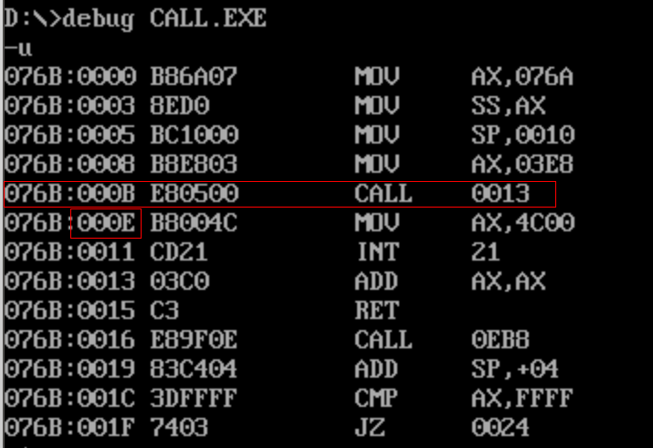

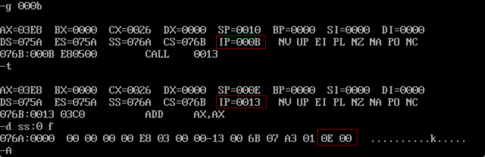

可以看到，当程序在000B后，下一条指令是000E，但是程序需要跳转`CALL 0EB8`,先把下一条指令`000E`的位置压入栈中。

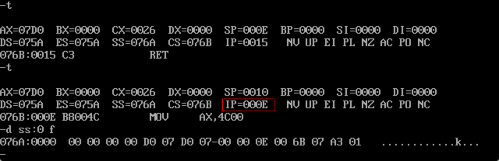

接着执行指令，发现当执行RET后，IP的值从栈中被弹出，程序可以继续向下执行。

## 汇编语言的模块化程序设计

```assembly
assume cs:code
code segment
main: ...
	  call sub1
	  ...
	  mov ax, 4c00h
	  int 21h
sub1: ...
	  call sub2
	  ...
	  ret
sub2: ...
	  ...
	  ret
code ends
end main
```


## 寄存器冲突的问题

## 标志寄存器

## 带进（借）位的加减法

### adc

adc-带进位加法指令

adc是带进位加法指令，它利用了CF位上记录的进位值。

- 格式：adc 操作对象1, 操作对象2
- 功能：操作对象1 =  操作对象1 + 操作对象1 +CF
- 例： adc ax,bx : (ax) = (ax)+(bx)+CF

### sbb指令

sbb是带借位减法指令

- 格式：sbb 操作对象1, 操作对象2
- 功能：操作对象1 =  操作对象1 - 操作对象1 - CF
- 例： sbb ax,bx : (ax) = (ax)-(bx)-CF

## cmp和条件转移指令应用

cmp指令

- 格式：cmp 操作对象1,操作对象2
- 功能：计算 操作对象1 - 操作对象2

cmp是比较指令，功能相当于减法指令，只是不保存结果

cmp指令执行后，将对标志寄存器产生影响

例如：

| 指令       | cmp ax,ax                                                    | mov ax,8<br />mov bx,3<br />mov ax,bx |
| ---------- | ------------------------------------------------------------ | ------------------------------------- |
| 功能       | 做（ax）- (ax)的运算，结果为0，但并不在ax中保存，仅影响flag的相关各位 | （ax）=8,<br />(bx) = 3               |
| 标志寄存器 | ZF=1 PF=1 SF=0 CF=0 OF=0                                     | ZF=0 PF=1 SF=0 CF=0 OF=0              |

转移指令

j-Jump e-Equal n-Not b-Below a-Above L-less g-Greater

s-Sign C-carry p-Parity o-Overflow z-zero

根据单个标志位转移的指令

| 指令        | 含义                   | 测试条件 |
| ----------- | ---------------------- | -------- |
| je/jz       | 相等/结果为0           | ZF=1     |
| jne/jnz     | 不等/结果不为0         | ZF=0     |
| js          | 结果为负               | SF=1     |
| jns         | 结果非负               | SF=0     |
| jo          | 结果溢出               | OF=1     |
| jno         | 结果溢出               | OF=0     |
| jp          | 奇偶位为1              | PF=1     |
| jnp         | 奇偶位不为1            | PF=0     |
| jb/jnze/jc  | 低于/不高于等于/有借位 | CF=1     |
| jnb/jae/jnc | 不低于/高于等于/无借位 | CF=0     |

根据无符号数比较结果进行转移的指令

| 指令        | 含义         | 测试条件   |
| ----------- | ------------ | ---------- |
| jb/jnae/jc  | 低于则转移   | CF=1       |
| jnb/jae/jnc | 低于则转移   | CF=0       |
| jna/jbe     | 不高于则转移 | CF=1或ZF=1 |
| ja/jnbe     | 高于则转移   | CF=0或ZF=0 |

根据由符号数比较结果进行转移的指令

| 指令    | 含义             | 测试条件   |
| ------- | ---------------- | ---------- |
| jl/jnge | 小于则转移       | SF=1且OF=0 |
| jnl/jge | 不小于则转移     | SF=0且OF=0 |
| jle/jng | 小于等于则转移   | SF=0或OF=1 |
| jnle/jg | 不小于等于则转移 | SF=1且OF=1 |

例1： 如果(ah)= (bh)，则(ah)= (ah)+(ah)，否则(ah)= (ah)+(bh)

```assembly
	cmp ah,bh
	je s
	add ah,bh
	jmp short ok
s:	add ah,ah
ok:	ret
```

例2： 如果(ah)= 0，则(ah)= (ah)+1

```assembly
	add ax,0
	jnz s
	inc ax
 s:	...
```


## 条件转移指令应用

## DF标志和串传送指令

功能：

- 在串处理指令中，控制每次操作后si,di的增减
- DF=0: 每次操作后si，di递增
- DF=1：每次操作后si，di递减

对DF位进行设置的指令：

- cld指令：将标志寄存器的DF位设位0（clear）
- std指令：将标志寄存器的DF位设位1（setup）

示例：将data段中的第一个字符串复制到它后面的空间中。

```assembly
assume cs:code, ds:data
data segment
	db 'welcome to masm!' 	; source
	db 16 dup (0)	;
data ends

code segment
start:	MOV AX,data
		MOV DS,AX
		MOV SI,0
		MOV ES,AX
		MOV DI,16
		CLD
		MOV CX,16
	S:	MOVSB
		LOOP S
		MOV AX,4c00h
		INT 21h
code ends
end	start
```

movsb: 以字节为单元传送。

movsw: 以字为单位传送。

### rep指令

常和串传送指令搭配使用。

根据cx的值，重复执行后面的指令。

```asm
rep movsb 
;等价
s: 	movsb
	loop s
	
rep movsw 
;等价
s: 	movsw
	loop s
```

# 中断及外部设备操作

## 直接定址表

### 移位指令

**S,SH**-Shift

**L**-Left

**R**-Right

**A**-Arithmetic

**R,RO**-Rotate

**C**-Carry

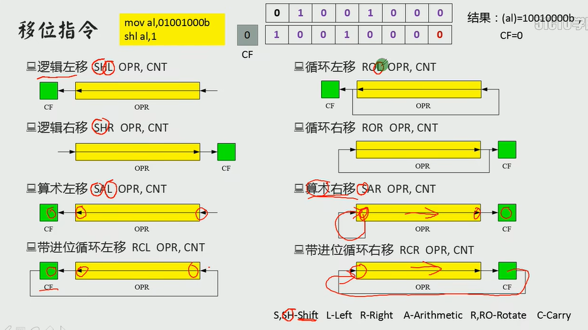

移动位数大于1时，必须用CL

### 操作显存数据

内存布局

| 地址范围      | 描述             | 大小     |
| ------------- | ---------------- | -------- |
| `00000-9FFFF` | 主存储器地址空间 | 640K RAM |
| `A0000-BFFFF` | 显存地址空间     | 128K RAM |
| `C0000-FFFFF` | 各类ROM地址空间  | 256KB    |

- **主存储器地址空间 (00000-9FFFF)**: 640K RAM
- **显存地址空间 (A0000-BFFFF)**: 128K RAM
- **各类ROM地址空间 (C0000-FFFFF)**: 256KB

其中`B8000~BFFFF`共32K的空间，是80*25彩色字符模式第0页的显示缓冲区。

**屏幕结构**

- 屏幕分为 **25行**，每行 **80列**。
- 每行占用 **160字节 (A0H)**，其中每个字符占用2个字节：低位字节是要显示字符的 ASCII 码，高位字节是显示属性字节。

**显示缓冲区地址范围**

| 行号   | 字节数    | 地址范围              |
| ------ | --------- | --------------------- |
| 第0行  | 160 (A0H) | B800:0000 ~ B800:009F |
| 第1行  | 160 (A0H) | B800:00A0 ~ B800:013F |
| 第2行  | 160 (A0H) | B800:0140 ~ B800:01DF |
| ...    | ...       | ...                   |
| 第24行 | 160 (A0H) | B800:0F00 ~ B800:0F9F |

每个显示缓冲区由16位组成，低位字节是要显示的符号，高位字节是显示的属性。

**属性字节结构**

- 每个属性字节用来设置字符的显示属性，包含以下位：

  | 7         | 6            | 5            | 4            | 3        | 2            | 1            | 0            |
  | --------- | ------------ | ------------ | ------------ | -------- | ------------ | ------------ | ------------ |
  | 闪烁 (BL) | 背景颜色 (R) | 背景颜色 (G) | 背景颜色 (B) | 高亮 (I) | 前景颜色 (R) | 前景颜色 (G) | 前景颜色 (B) |

例子：编写在屏幕的中间，白底蓝字，显示‘Welcome to masm!’.

```assembly
assume cs:code, ds:data
data segment
	db 'Welcome to masm!'
data ends

code segment
start:	MOV AX,data
		MOV DS,AX
		MOV AX,0B800H
		MOV ES,AX
		MOV SI,0
		MOV DI,160*12+80-16
		MOV CX,16
	S:	MOV AL,[SI]
		MOV ES:[DI],AL
		INC DI
		MOV AL,71H
		MOV ES:[DI],AL
		INC SI
		INC DI
		LOOP S
		MOV AX,4c00h
		INT 21h
code ends
end	start
```


### 描述内存单元的标号

nop

### 数据的直接定址表

nop

### 代码的直接定址表

nop

## 内中断

### 中断及其处理

**中断: **CPU不再接着(刚执行完的指令)向下执行，而是转去处理中断信息。

**内中断:** 由CPU内部发生的事件而引起的中断。

**外中断:** 由外部设备发生的事件引起的中断。

**CPU内部产生的中断信息**

| 内部中断类型       | 类型码  |
| ------------------ | ------- |
| 除法错误           | 0       |
| 单步执行           | 1       |
| 执行into指令       | 4       |
| 执行int指令，int n | n立即数 |

示例：hello world!

```assembly
assume cs:code, ds:data
data segment
	szmsg db 'Hello world!$'
data ends

code segment
start:	MOV AX,data
		MOV DS,AX
		LEA DX, szmsg ;  将字符串 szmsg 的地址加载到 DX 寄存器。
		MOV AH,9
		INT 21H
		
		MOV AX,4c00h
		INT 21h
code ends
end	start
```

**中断过程**

- 用中断类型码找中断向量表，并用它设置CS和IP，定位中断处理程序

**8086CPU中断向量表**

共1024字节，256种中断

| 地址      | 字节表示 | 说明                      |
| --------- | -------- | ------------------------- |
| 0000:0000 | IP       | 0号中断处理程序入口地址   |
| 0000:0002 | CS       |                           |
| 0000:0004 | IP       | 1号中断处理程序入口地址   |
| 0000:0006 | CS       |                           |
| ...       |          |                           |
| ...       |          |                           |
| 0000:03FC | IP       | 255号中断处理程序入口地址 |
| 0000:03FE | CS       |                           |

**8086CPU的中断过程**
(1) 从中断信息中取得中断类型码
(2) 标志寄存器的值人栈--中断过程中要改变标志寄存器的值，需要先行保护
(3) 设置标志寄存器的第8位TF和第9位IF的值为0
(4) CS的内容入栈
(5) IP的内容入栈
(6) 从中断向量表读取中断处理程序的入口地址，设置CS和IP

```
(1) 取得中断类型码N;
(2) pushf
(3) TF=0，IF=0
(4) push CS
(5) push IP
(6) (IP)=(N*4),(CS)=(N*4+2)	;N为中断类型码
```

### 编制中断处理程序

当除0的时候显示`overflow!`

```assembly
assume cs:code

code segment
start:	
		; do0安装程序
		MOV AX,CS
		MOV DS,AX
		MOV SI,offset do0
		MOV AX,0
		MOV ES,AX
		MOV DI,200H
		MOV CX,offset do0end-offset do0 ;do0部分代码的长度
		CLD
		REP MOVSB
		; 设置中断向量表
		mov ax,0
		mov es,ax
		mov word ptr es:[0*4],200h
		mov word ptr es:[0*4+2],0
		
		MOV AX,4c00h
		INT 21h
do0:	
		;显示字符串
		jmp short do0start
		db "overflow!"
do0start:
		mov ax,cs
		mov ds,ax
		mov si,202h
		mov ax,0b800h
		mov es,ax
		mov di,12*160+36*2
		mov cx,9
	s:	
		mov al,[si]
		mov es:[di],al
		inc si
		add di,2
		loop s
		
		MOV AX,4C00H
		INT 21H
do0end:	nop
code ends
end	start
```

上面的程序是把除0的中断程序写入了内存，我们执行下面的程序可以看到我们的中断程序执行了。

```assembly
mov ax,8
mov bh,0
div bh
```

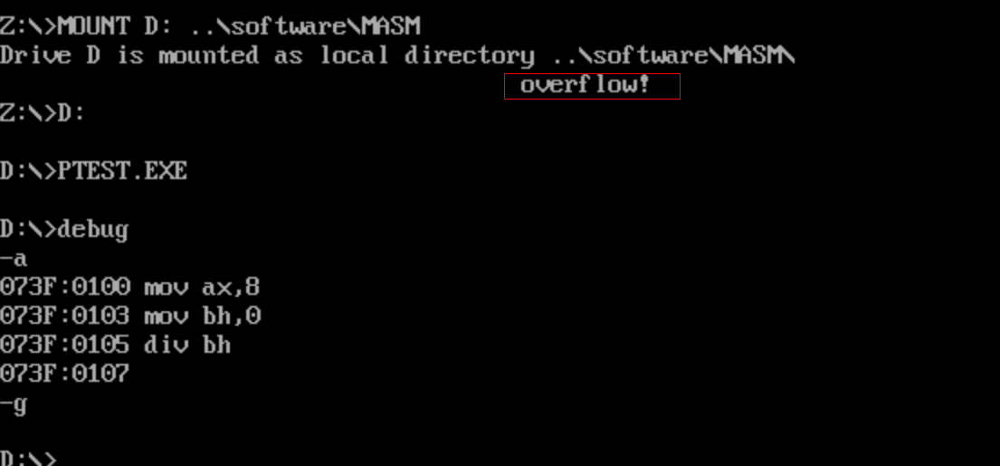

### 单步中断

nop

### 由int指令引发的中断

nop

### BIOS和DOS中断处理

**BIOS** : 基本输入/输出系统 (Basic Input / Output System），是系统板的ROM中存放着一套程序。

- 容量8KB
- 地址：从FE000H开始

**BIOS中的主要内容**
(1) 硬件系统的检测和初始化程序

(2) 外部中断和内部中断的中断例程

(3) 用于对硬件设备进行I/0操作的中断例程

(4) 其他和硬件系统相关的中断例程

**调用示例：**

> 任务:在屏幕的5行12列显示3个红底高亮闪烁绿色的'a'

用BIOS的10h中断

- （ah）= 2 时，调用第10h中断例程的2号子程序，设置光标位置
- （ah）= 9 时，调用第10h中断例程的9号子程序，设置光标位置显示字符

```assembly
assume cs:code

code segment
start:	
		mov ah,2	; 设置光标位置
		mov bh,0	; 第0页
		mov dx,512h	; 5行12列。dh中放行号，dl中放列号
		int 10h
		
		mov ah,9	; 显示字符功能
		mov al,'a'	; 字符
		mov bl,11001010b	; 颜色属性
		mov bh,0	; 第0页
		mov cx,3	; 字符重复个数
		int 10h	
		
		MOV AX,4C00H
		INT 21H
code ends
end	start
```

[bios中断 (ddatsh.com)](https://ddatsh.com/post/dev/linux/02-bios/)


DOS中断

示例：在5行12列显示字符串“welcome to masm!”

```assembly
assume cs:code
data segment
	db 'welcome to masm!'
data ends

code segment
start:	
		mov ah,2	; 设置光标位置
		mov bh,0	; 第0页
		mov dx,512h	; 5行12列。dh中放行号，dl中放列号
		int 10h
		
		mov ax,data
		mov ds,ax
		mov dx,0	;ds:dx指向字符串的首地址data:0
		mov ah,9	; 在光标位置显示字符串，ds:dx指向字符串,用'$'结束
		int 21h	
		
		MOV AX,4C00H
		INT 21H
code ends
end	start
```


## 端口及外设控制

### 端口的读写

**读写端口的指令**

- in : CPU从端口读取数据
- out：CPU往端口写入数据

**端口的读写指令示例**
对0~255以内的端口进行读写，端口号用立即数给出

```assembly
in al,20h 	;从20h端口读入一个字节
out 21,al 	;往21h端口写入一个字节
```

对256~65535的端口进行读写时，端口号放在dx中：

```assembly
mov dx,3f8h	;将端口号3f8送入dx
in al,dx	;从3f8h端口读入一个字节
out dx,al	;向3f8h端口写入一个字节
```

### 操作CMOS RAM芯片

nop

### 外设连接与中断

nop

### PC机键盘的处理过程

通码

断码

### 定制键盘输入处理

### 改写中断例程的方法

### 用中断响应外设

### 应用：字符串输入

### 磁盘读写

### 发声程序


